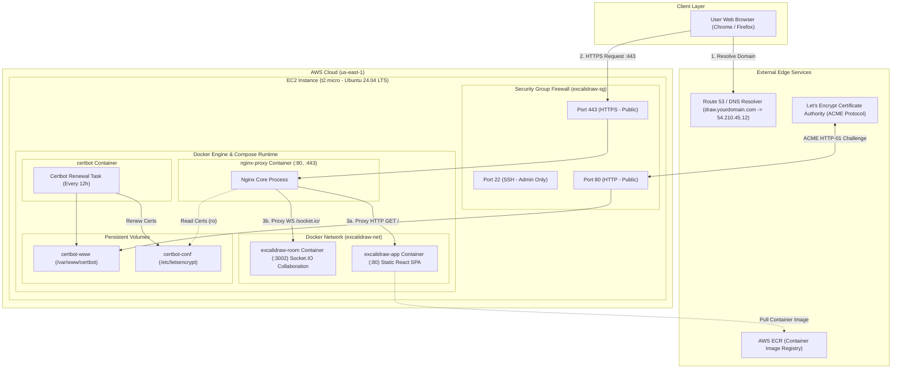
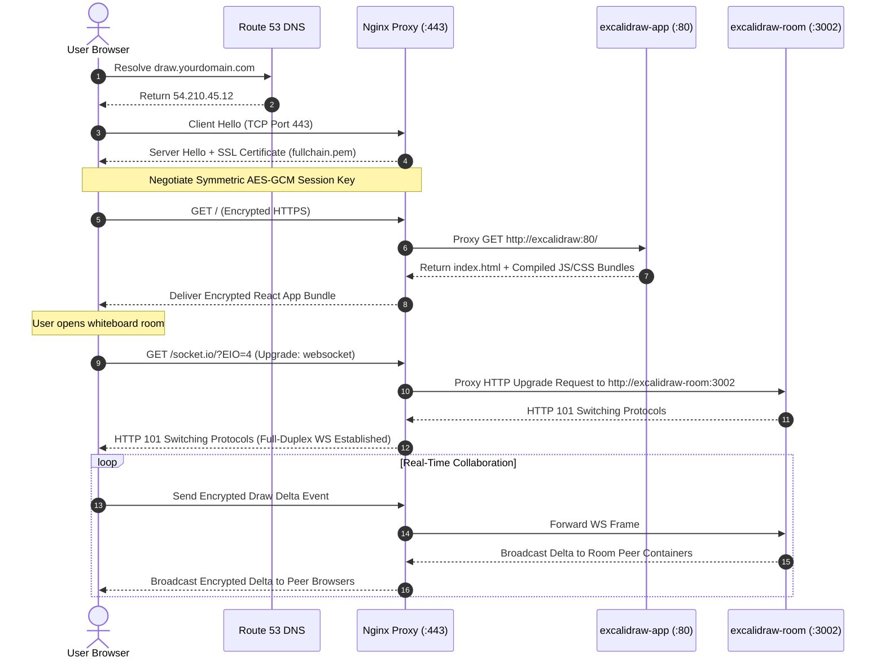
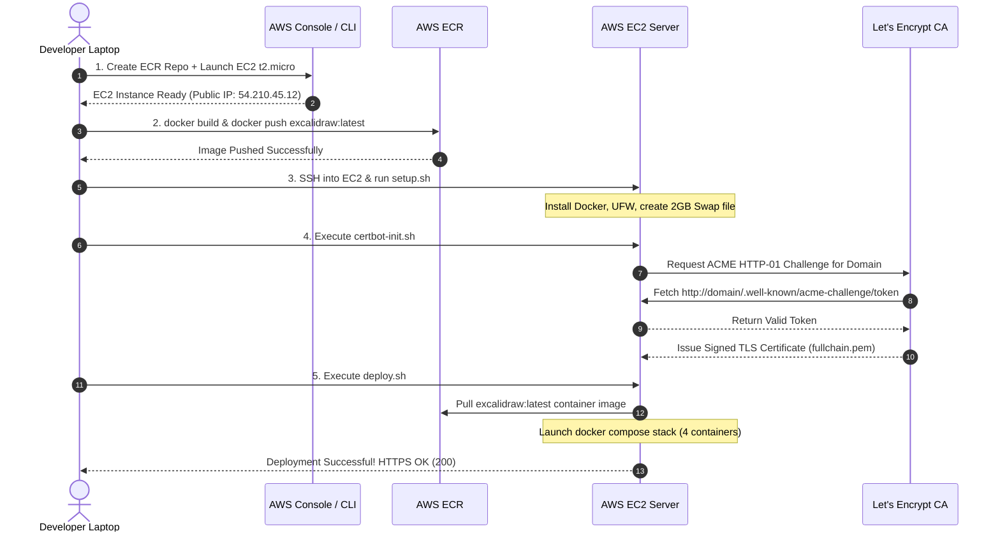

# Module 6: Intuitive Mental Models & Architectural Diagrams

[Back to Index](file:///v:/projects/excalidraw/excalidraw/learning-guide/00-index.md)

---

## PART 13: The Complete Real-World Mental Model Matrix

Cloud engineering can feel abstract because you cannot touch a virtual server or hold a network packet. To build an intuitive understanding, we map every component of our Excalidraw deployment to a consistent real-world analogy: **The Apartment Complex**.

```
┌────────────────────────────────────────────────────────────────────────┐
│                    THE APARTMENT COMPLEX MENTAL MODEL                  │
│                                                                        │
│  AWS Cloud              ──►  The Gated City Neighborhood                │
│  EC2 Instance           ──►  Rented Apartment Suite                    │
│  Ubuntu OS              ──►  Interior Walls & Utilities                │
│  Docker Engine          ──►  Building Property Manager                 │
│  Docker Image           ──►  Architectural Floor Plan Blueprint         │
│  Docker Container       ──►  Furnished Living Room                     │
│  Docker Volume          ──►  Locked Basement Storage Locker            │
│  Docker Network         ──►  Building Intercom Wiring                  │
│  Nginx Proxy            ──►  Front Desk Receptionist Concierge         │
│  DNS (Route 53)         ──►  GPS Address Navigation System             │
│  SSL Certificate (TLS)  ──►  Security Guard Armored Briefcase          │
└────────────────────────────────────────────────────────────────────────┘
```

---

### Deep Dive Analogy Mapping

| Component | Analogy Element | How It Explains The Technology |
| :--- | :--- | :--- |
| **AWS Cloud** | **The Gated City Neighborhood** | AWS owns land, electrical infrastructure, roads, and security. You rent space within their city. |
| **EC2 Instance** | **Rented Apartment Suite** | An empty space rented by the hour. You choose size (`t2.micro`), but hardware maintenance is handled by the landlord. |
| **Ubuntu 24.04** | **Interior Layout & Utilities** | Provides basic plumbing, floors, and electrical sockets so tools can function inside the suite. |
| **Docker Engine** | **Property Manager** | Ensures rooms stay clean, enforces noise limits (RAM caps), and restarts rooms if something breaks. |
| **Docker Image** | **Architectural Blueprint** | Stored in a library (ECR). Shows where furniture goes, but you can't sleep inside a paper drawing. |
| **Docker Container** | **Constructed Living Room** | Built directly from the blueprint. Multiple rooms can be built from one drawing instantly. |
| **Docker Volume** | **Basement Storage Locker** | Located outside the apartment room. If the room burns down (container destroyed), items in the storage locker remain intact. |
| **Docker Network** | **Internal Intercom System** | Wire between Room 1 and Room 2. Allows occupants to talk internally without opening front doors. |
| **Nginx Proxy** | **Front Desk Concierge** | Stands at the building entrance. Greets visitors, checks credentials (SSL), and routes people to Room 1 (SPA) or Room 2 (Sockets). |
| **DNS (Route 53)** | **GPS Address Book** | Converts "Excalidraw Headquarters" into exact latitude/longitude numerical coordinates (`54.210.45.12`). |
| **SSL / TLS** | **Armored Briefcase Security** | Encrypts messages passed between visitors and concierge so spies in the lobby can't read them. |

---

## PART 14: Visual Architecture & Flow Diagrams

### Diagram 1: Comprehensive System Architecture

This Mermaid diagram illustrates the exact production stack deployed on AWS:



---

### Diagram 2: User Request Sequence Flow

This sequence diagram traces a user opening Excalidraw and collaborating in real-time:



---

### Diagram 3: Chronological Deployment Sequence

This sequence diagram details the full lifecycle of setting up the deployment:



---

## 🔒 Chapter 6 Mini-Quiz

1. **In our apartment building mental model, what component corresponds to the Front Desk Receptionist Concierge?**
   - A) AWS EC2
   - B) Nginx Reverse Proxy Container
   - C) Docker Volume
   - D) Git Commit

2. **In Diagram 2 (Request Sequence Flow), why does Nginx return `HTTP 101 Switching Protocols` when proxying `/socket.io/`?**
   - A) To report a server crash
   - B) To confirm that the HTTP connection has been upgraded to a persistent, full-duplex WebSocket connection
   - C) To redirect traffic from HTTP to HTTPS
   - D) To request a new password

3. **What happens to data stored in a Docker Volume when a Docker Container is deleted and recreated?**
   - A) The volume data is deleted instantly
   - B) The volume data remains completely intact on the host storage filesystem
   - C) The volume data is uploaded to GitHub
   - D) The volume is converted into an AMI

*(Answers: 1-B, 2-B, 3-B)*

---

Next Step: Proceed to **[07-roadmap-and-vocabulary.md](file:///v:/projects/excalidraw/excalidraw/learning-guide/07-roadmap-and-vocabulary.md)** to explore the Cloud Career Roadmap and deployment Vocabulary Dictionary!
