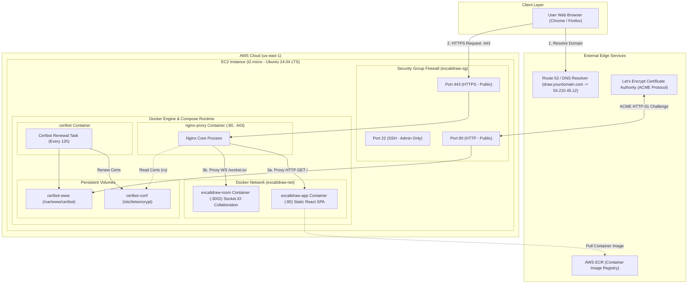
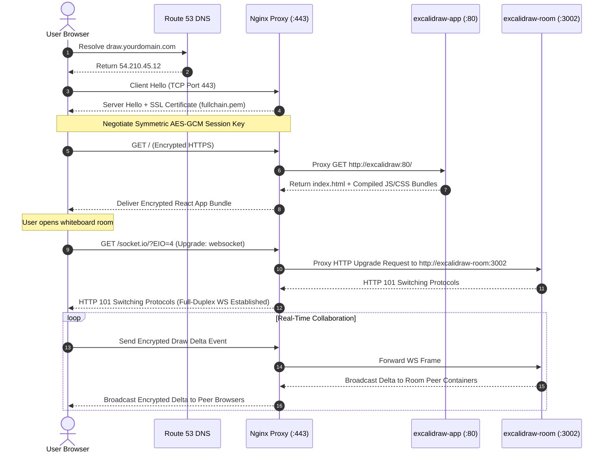
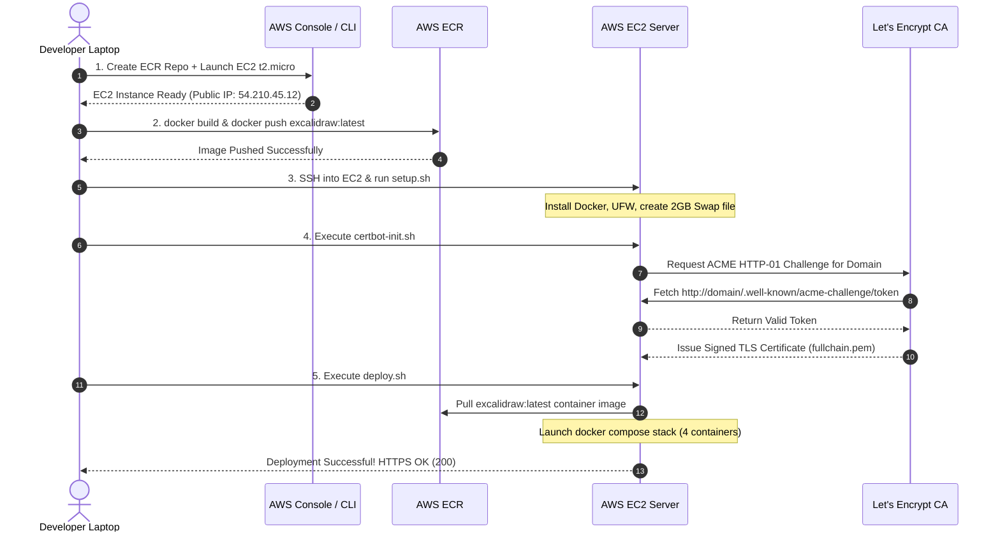

# Excalidraw-on-AWS: Complete Cloud Engineering Curriculum

Welcome to the comprehensive, university-level Cloud Engineering Learning Guide based on the actual deployment of **Excalidraw** on **Amazon Web Services (AWS)** using EC2, Ubuntu 24.04 LTS, Docker, Nginx reverse proxying, Let's Encrypt TLS certificates, and AWS ECR.

---

## 🎯 Curriculum Goal

This guide is written for a first-year Computer Science student with basic programming knowledge and **zero** prior experience in Linux system administration, AWS cloud infrastructure, networking, Docker containerization, or SSL/TLS security.

After completing this curriculum, you will be able to explain **every component**, **command**, **configuration**, and **troubleshooting step** of a production web application deployment to anyone—without needing AI assistance.

---

## 📚 Curriculum Navigation

| Module File | Chapter / Scope | Core Topics Covered |
| :--- | :--- | :--- |
| **[00-index.md](file:///v:/projects/excalidraw/excalidraw/learning-guide/00-index.md)** | **Course Overview** | Table of Contents, Prerequisites, How to Use This Curriculum |
| **[01-big-picture-and-aws.md](file:///v:/projects/excalidraw/excalidraw/learning-guide/01-big-picture-and-aws.md)** | **Parts 1 & 2** | The Big Picture of Cloud Engineering, History of Web Hosting, What is AWS, Cloud vs On-Premises |
| **[02-servers-ec2-linux.md](file:///v:/projects/excalidraw/excalidraw/learning-guide/02-servers-ec2-linux.md)** | **Parts 3, 4 & 5** | Physical vs Cloud Servers, AWS EC2 (`t2.micro`), Ubuntu 24.04 LTS, Terminal, SSH, File Permissions & Linux Commands |
| **[03-git-docker.md](file:///v:/projects/excalidraw/excalidraw/learning-guide/03-git-docker.md)** | **Parts 6 & 7** | Git & GitHub Version Control, Docker Engine, Containers vs VMs, Docker Compose, Networks, Volumes & Health Checks |
| **[04-nginx-dns-ssl.md](file:///v:/projects/excalidraw/excalidraw/learning-guide/04-nginx-dns-ssl.md)** | **Parts 8, 9 & 10** | Nginx Reverse Proxy, WebSockets, Domain Names, DNS A-records, HTTPS, TLS & Let's Encrypt Certbot |
| **[05-deployment-and-mistakes.md](file:///v:/projects/excalidraw/excalidraw/learning-guide/05-deployment-and-mistakes.md)** | **Parts 11 & 12** | Chronological Deployment Walkthrough (`setup.sh`, `certbot-init.sh`, `deploy.sh`) & Root-Cause Troubleshooting Guide |
| **[06-mental-models-and-diagrams.md](file:///v:/projects/excalidraw/excalidraw/learning-guide/06-mental-models-and-diagrams.md)** | **Parts 13 & 14** | Extended Real-World Analogy (The Apartment Building) & Mermaid Architectural / Request Flow Diagrams |
| **[07-roadmap-and-vocabulary.md](file:///v:/projects/excalidraw/excalidraw/learning-guide/07-roadmap-and-vocabulary.md)** | **Parts 15 & 16** | Zero-to-Hero Cloud Engineering Career Roadmap & 120+ Deployment Vocabulary Dictionary |
| **[08-interview-prep.md](file:///v:/projects/excalidraw/excalidraw/learning-guide/08-interview-prep.md)** | **Part 17** | 60 Deep Technical Interview Questions & Answers (25 Beginner, 25 Intermediate, 10 Scenario-Based) |
| **[09-industry-and-reflection.md](file:///v:/projects/excalidraw/excalidraw/learning-guide/09-industry-and-reflection.md)** | **Parts 18, 19 & 20** | Industry Architectures (Netflix, Uber, GitHub), Personal Self-Reflection, & Transformation Story |

---

## 🛠️ The Deployment Architecture at a Glance

The curriculum explains this exact production architecture built during our deployment:

```
Internet Users (HTTPS:443 / HTTP:80)
         │
         ▼
┌─────────────────────────────────────────────────────────┐
│ AWS EC2 Instance (t2.micro — Ubuntu 24.04 LTS)          │
│ Public Elastic IP: static A-record                      │
│ Firewall (UFW): Ports 22 (SSH), 80 (HTTP), 443 (HTTPS)   │
│                                                         │
│ ┌─────────────────────────────────────────────────────┐ │
│ │ Docker Engine & Docker Compose                      │ │
│ │                                                     │ │
│ │  ┌─────────────────┐       ┌─────────────────────┐  │ │
│ │  │  nginx-proxy    │ ────► │  excalidraw-app     │  │ │
│ │  │  (:80, :443)    │       │  (ECR SPA container)│  │ │
│ │  └────────┬────────┘       └─────────────────────┘  │ │
│ │           │                                         │ │
│ │           └──────────────► ┌─────────────────────┐  │ │
│ │                            │ excalidraw-room     │  │ │
│ │                            │ (WebSocket relay)   │  │ │
│ │                            └─────────────────────┘  │ │
│ │  ┌─────────────────┐                                │ │
│ │  │ certbot renew   │ (Auto-renews certs every 12h)  │ │
│ │  └─────────────────┘                                │ │
│ └─────────────────────────────────────────────────────┘ │
└─────────────────────────────────────────────────────────┘
```

---

## 💡 Key Pedagogical Principles

1. **Why Before How**: We never teach a tool or command until you understand the exact problem it exists to solve.
2. **Zero Assumptions**: Every jargon term is defined immediately upon first use.
3. **Empirical Grounding**: Every command, file path, error message, and fix matches the real deployment scripts (`deploy/setup.sh`, `deploy/certbot-init.sh`, `deploy/deploy.sh`, `deploy/docker-compose.ec2.yml`, `deploy/nginx-proxy.conf`).
4. **Active Recall**: Every module ends with a mini-quiz and practical exercises to lock in your understanding.

Let's begin! Head over to **[01-big-picture-and-aws.md](file:///v:/projects/excalidraw/excalidraw/learning-guide/01-big-picture-and-aws.md)** to start Part 1.

---

# Module 1: The Big Picture & Understanding AWS

---

## PART 1: The Big Picture of Web Hosting & Cloud Engineering

### 1.1 What is Cloud Engineering?

**Cloud Engineering** is the practice of designing, building, deploying, and maintaining computer software and systems on remote server networks managed by specialized cloud providers (like Amazon Web Services, Google Cloud, or Microsoft Azure), rather than on physical computers owned directly by your company.

To understand Cloud Engineering, think of the software you write on your laptop. When you double-click an application or open a webpage on `localhost`, that software is running on **your local machine**. If you shut your laptop screen, turn off your Wi-Fi, or put your laptop in a backpack, nobody else on Earth can open your application.

Cloud Engineering is how we take software out of our personal laptops and put it onto computers connected to high-speed internet 24 hours a day, 7 days a week, 365 days a year, so that millions of users across the globe can access it simultaneously.

---

### 1.2 How Applications Were Hosted Before Cloud Computing (The On-Premises Era)

Twenty years ago (in the late 1990s and early 2000s), if a company wanted to run a website, they had to manage their own **on-premises (on-prem)** physical hardware.

Here is step-by-step how a tech company deployed a web app in the year 2002:

```
[1. Order Hardware] ──► [2. Wait 6 Weeks] ──► [3. Rack & Cable] ──► [4. Install OS] ──► [5. Deploy Code]
  Dell/HP Server          Shipping/Customs       Datacenter Cage       Linux/Windows       FTP / Manual Copy
```

1. **Order Hardware**: The company had to order expensive physical computer towers or rack-mounted server hardware from manufacturers like Dell, HP, or IBM. A single business server could easily cost $10,000 to $50,000 upfront.
2. **Wait for Delivery**: Shipping, customs, and delivery took anywhere from 3 weeks to 2 months.
3. **Lease Datacenter Space**: Companies had to rent space in a dedicated physical facility called a **datacenter** (or build their own server room with specialized industrial air conditioning and backup diesel generators).
4. **Physical Installation (Racking and Stacking)**: System administrators had to physically drive to the datacenter, mount the heavy metal server boxes into 19-inch steel racks with screwdrivers, plug in power cables, and run Ethernet cables to networking switches.
5. **Operating System Setup**: Admins manually inserted a CD-ROM or USB drive into the server box to install an operating system like Linux or Windows Server.
6. **Deployment**: Developers used legacy tools like FTP (File Transfer Protocol) to copy raw files directly onto the server's hard drive.

---

### 1.3 The Fatal Problems of Pre-Cloud Infrastructure

This traditional hardware-first approach had massive structural flaws:

| Problem | What Happened in Real Life | What Would Break |
| :--- | :--- | :--- |
| **Enormous Upfront Capital (CapEx)** | Starting a basic tech business required $100,000+ in hardware purchases before serving a single customer. | College students and solo developers were completely priced out of building internet companies. |
| **Capacity Guessing & Over-provisioning** | If you expected 10,000 users, you had to purchase 10 servers. If only 200 users showed up, 90% of your money was completely wasted. | Companies burned millions of dollars on idle silicon sitting in air-conditioned rooms doing zero work. |
| **Traffic Spikes & Server Crashes** | If your product went viral on television or news, 50,000 users tried to connect at once. Your 2 servers ran out of CPU/RAM and crashed. | The website went completely offline. You couldn't buy and install new hardware fast enough (it took weeks). |
| **Physical Disasters & Outages** | A thunderstorm cut power to the building, a backhoe cut the fiber optic line in the street, or an air conditioner failed and melted CPUs. | Your business stopped functioning instantly unless you owned a second redundant physical datacenter in another city. |

> **Real-World Story: The Black Friday Catastrophe**  
> In 2004, retail websites frequently crashed on Black Friday because millions of shoppers rushed to the site simultaneously. E-commerce companies had to buy hundreds of expensive servers in August just to handle 48 hours of heavy holiday traffic in November—leaving those servers sitting completely empty and idle for the remaining 10 months of the year.

---

### 1.4 The Paradigm Shift: Why Cloud Computing Took Over

Cloud computing solved all of these problems by transforming **hardware into software**.

Instead of buying physical boxes, cloud providers built massive data centers filled with hundreds of thousands of servers worldwide. They wrapped those servers in software APIs (Application Programming Interfaces). Now, instead of picking up a screwdriver, a developer could send an HTTP request or click a button on a web dashboard to rent 1% of a server for $0.01 per hour.

```
┌────────────────────────────────────────────────────────────────────────┐
│                          THE CLOUD PARADIGM                            │
│                                                                        │
│   Old World (On-Premises):   Buy Hardware ──► Pay $50,000 Upfront       │
│   New World (Cloud):         Rent Utility  ──► Pay $0.01/Hour (API)     │
└────────────────────────────────────────────────────────────────────────┘
```

---

## PART 2: What is AWS (Amazon Web Services)?

### 2.1 AWS Explained Like You Are 10 Years Old

Imagine you want to build a massive, intricate Lego castle with motor-powered drawbridges, working lights, and water fountains.

- **Option A (The Old Way)**: You have to build a plastics factory, purchase raw petroleum, build injection molds, manufacture every plastic Lego brick yourself, construct a power plant to run the motors, and dig a canal for the water.
- **Option B (The AWS Way)**: You go to a giant toy rental shop. The shop has infinite Lego bricks of every shape, size, and color already manufactured. You pick out 50 bricks, build your castle for two hours, pay $0.25 for the time you used them, and return them when you're done.

**AWS (Amazon Web Services)** is that giant digital rental shop. AWS owns massive buildings across the globe packed with millions of high-performance computers, drives, optical fibers, and networking gear. AWS lets developers rent compute power, file storage, database capacity, and networking tools over the internet in seconds.

---

### 2.2 Why Did Amazon Create AWS?

In the early 2000s, Amazon.com was growing rapidly as an online bookstore and retailer. Every time an Amazon engineering team wanted to launch a new feature (like customer reviews or 1-Click checkout), they spent 70% of their time building infrastructure—setting up databases, configuring servers, and wiring networks—and only 30% actually writing application code.

Amazon realized:
1. They had accidentally built world-class internal tools to automate server provisioning.
2. Every other company on Earth suffered from the exact same infrastructure headache.

In 2006, Amazon launched AWS, publicly offering services like **S3** (Simple Storage Service for files) and **EC2** (Elastic Compute Cloud for virtual servers). Today, AWS generates over $90 Billion per year and powers over 30% of the entire public cloud market.

---

### 2.3 Why Startups and Tech Giants Use AWS

#### Why Startups (like early Airbnb or Instagram) Use AWS:
- **Zero Upfront Cost**: A student can launch an EC2 server for $0/month on the AWS Free Tier.
- **Speed to Market**: You can launch a global server infrastructure in 30 seconds instead of 3 months.
- **Focus on Core Product**: Founders focus on building app features rather than fixing power supplies or replacing fried hard drives.

#### Why Tech Giants (like Netflix) Use AWS:
- **Infinite Elastic Scale**: Netflix streams video to hundreds of millions of screens simultaneously. On Friday night at 8 PM, streaming traffic skyrockets. On AWS, Netflix automatically boots up tens of thousands of extra virtual servers in minutes, then automatically shuts them down at 3 AM when people go to sleep—paying only for the exact minutes used.
- **Global Reach**: AWS has datacenters in North America, Europe, Asia, South America, Australia, and Africa. Netflix can host videos close to users in Tokyo or London to eliminate buffering delays.

---

### 2.4 The Fundamental Request Flow: Developer to User

Here is how code flows from your hands to a user's screen in our Excalidraw architecture on AWS:

```
┌──────────────┐
│  Developer   │ (You write code on your laptop)
└──────┬───────┘
       │  1. Push code / Build Docker Image
       ▼
┌──────────────┐
│   AWS ECR    │ (Amazon Elastic Container Registry — Stores built image)
└──────┬───────┘
       │  2. Pull image over private AWS network
       ▼
┌──────────────┐
│   AWS EC2    │ (Virtual Server running Ubuntu 24.04 LTS)
│ ┌──────────┐ │
│ │  Docker  │ │  3. Runs Nginx + Excalidraw SPA + Socket.IO Relay
│ └──────────┘ │
└──────▲───────┘
       │  4. HTTPS Requests over Port 443
┌──────┴───────┘
│ End-User     │ (Visits draw.yourdomain.com in browser)
└──────────────┘
```

---

## 🔒 Chapter 1 Mini-Quiz

Test your understanding before proceeding!

1. **What was the primary financial risk of hosting web apps on-premises before cloud computing?**
   - A) High monthly domain renewal fees
   - B) Massive upfront capital expenditure (CapEx) on physical servers that might go unused
   - C) License fees paid to Docker
   - D) Paying for electricity in foreign countries

2. **Why does Netflix use AWS instead of buying its own servers?**
   - A) AWS makes movies for Netflix
   - B) Netflix doesn't know how to program
   - C) Netflix needs elastic scale to dynamically add servers during peak evening traffic and remove them at night
   - D) Physical servers cannot play video files

3. **In our Excalidraw architecture, what role does AWS ECR play?**
   - A) It serves HTML directly to web browsers
   - B) It acts as a secure storage registry for our packaged Docker container images
   - C) It issues Let's Encrypt SSL certificates
   - D) It assigns domain names to IP addresses

*(Answers: 1-B, 2-C, 3-B)*

---

learn about Servers, AWS EC2, and Linux Administration!

---

# Module 2: Servers, AWS EC2 & Linux Administration

---

## PART 3: Understanding Servers & Hardware Components

### 3.1 What is a Server?

A **server** is simply a computer that is connected to a network and configured to receive incoming network requests, process them, and return responses back to the requester (the client).

There is no magical fairy dust inside a server. At its core, a server contains the exact same hardware components as your personal laptop or smartphone:
- A Central Processing Unit (**CPU**) to compute logic
- Random Access Memory (**RAM**) to hold active execution state
- A Hard Drive or Solid State Drive (**Disk Storage**) to save persistent files
- A Network Interface Card (**NIC**) to talk to the internet

```
┌────────────────────────────────────────────────────────────────────────┐
│                        SERVER VS LAPTOP COMPARISON                     │
│                                                                        │
│   Feature             Personal Laptop           Cloud Server (EC2)     │
│   ──────────────────────────────────────────────────────────────────   │
│   Display             Built-in Screen           Headless (No monitor)  │
│   Power               Battery / Shuts off       Dual redundant PSUs    │
│   IP Address          Changes (Dynamic)         Static (Elastic IP)    │
│   Operating System    Windows / macOS           Ubuntu Linux (CLI)     │
│   Uptime              Closes when folded        99.99% (Always On)     │
└────────────────────────────────────────────────────────────────────────┘
```

---

### 3.2 Why Can't You Host Excalidraw on Your Personal Laptop?

Beginners often ask: *"I have Node.js running on my laptop at `localhost:3000`. Why can't I just give my friends my IP address and host my website from home?"*

Here are five technical reasons why home hosting fails:

1. **Dynamic IP Addresses & CGNAT**: Home Internet Service Providers (ISPs like Comcast, AT&T, or Spectrum) change your home IP address frequently. Furthermore, most ISPs use CGNAT (Carrier-Grade NAT), sharing one public IP among hundreds of homes. Outside users cannot reach your specific laptop.
2. **Blocked Inbound Ports**: Residential ISPs explicitly block incoming traffic on Port 80 (HTTP) and Port 443 (HTTPS) to prevent consumers from running servers on home connections.
3. **Power & Sleep Modes**: If your laptop goes to sleep, shuts down to install updates, or loses Wi-Fi connection, your website goes completely offline worldwide.
4. **Asymmetric Upstream Bandwidth**: Home internet gives you fast download speeds (e.g., 300 Mbps) but very slow upload speeds (e.g., 10 Mbps). If 50 users try to download your Excalidraw website assets simultaneously, your home upload link saturates and freezes.
5. **No ECC Memory**: Home laptops use standard RAM. If a cosmic ray or static charge flips a bit in RAM, your laptop blue-screens or crashes. Enterprise servers use **ECC (Error-Correcting Code)** RAM to detect and fix bit flips automatically.

---

### 3.3 The Core Hardware Resources Deep Dive

Let's understand the hardware specs of our deployment's server (**AWS `t2.micro`**):

#### 1. CPU (Central Processing Unit) — The Server's Brain
- **What it is**: The silicon microchip that executes code instructions step-by-step.
- **t2.micro Allocation**: 1 vCPU (Virtual CPU core running on an Intel Xeon processor).
- **Analogy**: The chef in a kitchen. The faster the chef, the quicker orders are cooked.
- **What breaks without it**: If CPU usage hits 100%, incoming requests queue up, responses lag, and the website stops loading.

#### 2. RAM (Random Access Memory) — The Short-Term Scratchpad
- **What it is**: Ultra-fast electronic memory where running programs (Docker containers, Node.js runtime, Nginx) store active data.
- **t2.micro Allocation**: 1 GiB (Gibibyte) = 1,024 Megabytes.
- **Analogy**: The countertop space in the kitchen. If the countertop is full, the chef cannot chop veggies or assemble dishes.
- **What breaks without it (Out-Of-Memory / OOM)**: If programs demand more RAM than the 1 GiB available, the Linux kernel triggers the **OOM Killer** process, instantly terminating your application to prevent the entire system from freezing.

#### 3. Disk Storage (AWS EBS) — The Long-Term Filing Cabinet
- **What it is**: Non-volatile storage (Solid-State Drive) that retains files even when power is turned off.
- **Our Setup**: 30 GB AWS **gp3 (General Purpose SSD)** volume.
- **Analogy**: The walk-in refrigerator where raw ingredients and physical documents are safely locked away.
- **What breaks without it**: If disk space reaches 100%, log files cannot be written, Docker cannot pull new images, and databases crash.

#### 4. Network Bandwidth & IP Addresses — The Delivery Roads
- **Public IP**: A unique numerical street address (e.g., `54.210.45.12`) that allows any computer on the global internet to find your server.
- **Private IP**: An internal address (e.g., `172.31.16.4`) used exclusively for servers within the same AWS private virtual network to talk to each other without touching the public internet.

---

## PART 4: AWS EC2 (Elastic Compute Cloud)

### 4.1 What Exactly is EC2?

**AWS EC2 (Elastic Compute Cloud)** is a service that provides resizable **virtual machines (VMs)** on demand.

When you rent an EC2 instance, AWS does not ship a physical computer to your house. Instead, AWS takes a massive physical server box (with 128 physical CPUs and 512 GB of RAM) in one of their data centers, runs a software manager called a **hypervisor**, and slices off a portion of that hardware for you:

```
┌────────────────────────────────────────────────────────────────────────┐
│                   PHYSICAL HOST IN AWS DATA CENTER                     │
│                                                                        │
│  ┌─────────────────────────┐  ┌─────────────────────────┐  ┌─────────┐ │
│  │ EC2 Instance 1          │  │ EC2 Instance 2 (YOURS)  │  │ EC2 3   │ │
│  │ Customer A (8 vCPUs)    │  │ t2.micro (1 vCPU, 1GB) │  │ ...     │ │
│  └─────────────────────────┘  └─────────────────────────┘  └─────────┘ │
│ ══════════════════════════════════════════════════════════════════════ │
│                      AWS NITRO / KVM HYPERVISOR                        │
│ ══════════════════════════════════════════════════════════════════════ │
│              PHYSICAL INTEL XEON HARDWARE (CPUs / RAM / NICs)          │
└────────────────────────────────────────────────────────────────────────┘
```

---

### 4.2 Why Ubuntu 24.04 LTS?

When creating an EC2 instance, you must select an **AMI (Amazon Machine Image)**, which acts as the operating system template. We selected **Ubuntu Server 24.04 LTS**:

- **Linux**: Linux is open-source, lightweight, incredibly stable, and consumes minimal system resources (unlike Windows Server, which requires 2+ GB of RAM just to draw its graphical user interface).
- **Ubuntu**: The world's most popular Linux distribution for developers, providing the vast `apt` software repository.
- **24.04**: The release year (2024) and month (April).
- **LTS (Long-Term Support)**: Canonical guarantees security updates, bug fixes, and maintenance for **5 years** free of charge.

---

### 4.3 Step-by-Step EC2 Launch Configuration Breakdown

Here is what every setting meant when launching our server:

| Field in AWS Console | Value Chosen | Technical Explanation & Why |
| :--- | :--- | :--- |
| **Instance Name** | `excalidraw-prod` | A human-readable label to identify our production server in the AWS list. |
| **AMI (OS)** | `Ubuntu 24.04 LTS` | Operating system pre-installed onto the virtual hard drive. |
| **Instance Type** | `t2.micro` | Hardware allocation: 1 vCPU, 1 GB RAM. Eligible for AWS Free Tier (750 hours/month free). |
| **Key Pair** | `excalidraw-key.pem` | RSA Cryptographic key pair. AWS places the public key on the server; you download the private key (`.pem`) to authenticate SSH connections safely without passwords. |
| **Network Settings** | VPC Default | Virtual Private Cloud subnet placement. |
| **Security Group** | `excalidraw-sg` | Virtual Firewall controlling inbound and outbound network traffic rules (Ports 22, 80, 443). |
| **Storage** | 30 GB `gp3` SSD | Elastic Block Store volume size. 30 GB is 100% free under the AWS 12-month free tier. |
| **IAM Instance Role** | `excalidraw-ec2-role` | Grants the server permission to call AWS ECR APIs securely without hardcoding secret keys on disk. |

---

### 4.4 Security Group Rules: Firewall Security

A **Security Group** acts as a strict guard at the door of your EC2 instance. By default, **all incoming traffic is blocked** unless explicitly allowed:

```
                     SECURITY GROUP (excalidraw-sg)
                              ┌──────────┐
  Port 22 (SSH) ────────────► │ ALLOWED  │ ──► Admin Access (My IP Only)
                              ├──────────┤
  Port 80 (HTTP) ───────────► │ ALLOWED  │ ──► ACME Challenge & Redirect (0.0.0.0/0)
                              ├──────────┤
  Port 443 (HTTPS) ─────────► │ ALLOWED  │ ──► Production Traffic (0.0.0.0/0)
                              ├──────────┤
  Port 3306 (MySQL) ────────► │ BLOCKED! │ ──► Dropped instantly
                              └──────────┘
```

> **Warning**: Never set Port 22 (SSH) source to `0.0.0.0/0` (Everywhere). Automated botnet scanners constantly brute-force open SSH ports across the entire internet. Set SSH to **My IP** only!

---

### 4.5 Elastic IP Allocation

When you launch an EC2 instance, AWS assigns a **Public IP**. However, if you stop and restart the instance, AWS reclaims that IP and assigns a totally new one!

To fix this, we allocated an **Elastic IP**: a permanent, static IPv4 address reserved for your AWS account. We associated it with `excalidraw-prod`. Now, even if the EC2 instance reboots 100 times, its public IP address never changes, keeping our DNS A-record pointing to the right place.

---

## PART 5: Linux Administration & Commands Deep Dive

### 5.1 The Terminal, Shell, and SSH

Since our cloud server has no monitor or mouse, we interact with it through text using the **CLI (Command Line Interface)**:

- **Terminal**: The text window program running on your laptop.
- **Shell (Bash)**: The command interpreter running on Ubuntu that reads your typed text (e.g. `ls`, `cd`, `docker`) and translates it into kernel operations.
- **SSH (Secure Shell)**: An encrypted network protocol operating on Port 22 that securely connects your local terminal to the remote server's shell.

```bash
# How we SSH into our server:
chmod 400 ~/Downloads/excalidraw-key.pem
ssh -i ~/Downloads/excalidraw-key.pem ubuntu@54.210.45.12
```

---

### 5.2 Linux File Permissions & Superuser Privileges

Linux is a multi-user operating system with strict access controls.

#### The `root` User vs `ubuntu` User
- `ubuntu`: Standard unprivileged user account. Can read most files but cannot install software or modify system settings.
- `root`: The absolute superuser with god-mode control over the entire operating system.
- `sudo` (SuperUser DO): A command that allows the `ubuntu` user to execute a single command with root privileges.

#### Understanding Permission Strings (e.g., `-rw-r--r--` or `drwxr-xr-x`)
Every file and directory has 9 permission bits divided into three groups:

```
 ┌─ Directory flag ('d' = directory, '-' = regular file)
 │
 │  ┌── Owner permissions (User)
 │  │      ┌── Group permissions (Group)
 │  │      │      ┌── Others permissions (World)
 ▼  ▼      ▼      ▼
 d r w x  r - x  r - x   (Octal: 755)
   │ │ │  │   │  │   │
   │ │ │  │   │  └─ Read (4)
   │ │ │  │   └──── Execute (1)
   │ │ │  └──────── Read (4)
   │ │ └─────────── Execute (1)
   │ └────────────── Write (2)
   └──────────────── Read (4)
```

- **Read (`r`)** = 4 points: Ability to view file content or list directory files.
- **Write (`w`)** = 2 points: Ability to modify/delete file content or create files in directory.
- **Execute (`x`)** = 1 point: Ability to execute a file as a program or `cd` into a directory.

```bash
# Granting permission examples:
chmod 400 key.pem       # Owner: Read-only (4+0+0 = 4). Group: None. Others: None. (Required by SSH)
chmod +x setup.sh       # Adds Execute permission so setup.sh can be run as a script.
chown -R ubuntu:ubuntu /opt/excalidraw # Recursively changes file ownership to 'ubuntu' user and group.
```

---

### 5.3 Linux Filesystem Hierarchy Standard (FHS)

Unlike Windows (which uses drive letters like `C:\` and `D:\`), Linux uses a single root directory tree starting at `/`:

```
/ (Root Directory)
├── bin/          ← Essential command binaries (cat, ls, cp)
├── etc/          ← System configuration files (nginx.conf, ufw configs)
├── home/
│   └── ubuntu/   ← Default home folder for the 'ubuntu' user (~/)
├── opt/          ← Reserved for optional/third-party add-on software packages
│   └── excalidraw/  ← OUR DEPLOYMENT ROOT LOCATION!
│       ├── repo/
│       ├── logs/
│       └── certbot/
├── var/
│   ├── log/      ← System log files
│   └── www/      ← Web files (Certbot ACME challenge)
└── tmp/          ← Temporary storage cleared on reboot
```

---

### 5.4 Deconstructing Every Command in `deploy/setup.sh`

When we executed `sudo bash deploy/setup.sh`, here is precisely what happened under the hood:

```bash
# 1. Update APT Package Index
apt-get update -qq
# WHY: Downloads the latest list of available software packages and versions from Ubuntu mirrors.

# 2. Install Required Base Utilities
apt-get install -y ca-certificates curl fail2ban git jq ufw
# WHY:
#   ca-certificates: Enables validating SSL/TLS security certificates.
#   curl / wget: Downloads files over HTTP/HTTPS from the terminal.
#   fail2ban: Scans logs and bans IP addresses that repeatedly fail SSH password logins.
#   git: Source control software to clone our Excalidraw repo.
#   jq: Command-line JSON processor for reading Docker/AWS configs.
#   ufw: Uncomplicated Firewall command-line frontend.

# 3. Create 2 GB Swap File (CRITICAL FOR t2.micro)
fallocate -l 2G /swapfile
chmod 600 /swapfile
mkswap /swapfile
swapon /swapfile
echo '/swapfile none swap sw 0 0' >> /etc/fstab
```

> **Why Swap File is Mandatory on t2.micro**:  
> Since our `t2.micro` server has only **1 GB of physical RAM**, running Nginx, Docker Engine, Certbot, and Excalidraw simultaneously can push RAM usage above 1,024 MB.  
> **Swap** creates virtual memory on the hard drive (EBS SSD). When physical RAM fills up, Linux temporarily moves inactive memory pages to disk space instead of crashing the server with an OOM error!

```bash
# 4. Configure UFW Firewall
ufw default deny incoming  # Block everything by default
ufw default allow outgoing # Allow server to talk to internet
ufw allow 22/tcp          # Allow SSH admin port
ufw allow 80/tcp          # Allow HTTP port
ufw allow 443/tcp         # Allow HTTPS port
ufw --force enable        # Turn firewall on
```

---

## 🔒 Chapter 2 Mini-Quiz

1. **Why does an SSH client reject a private key file (`key.pem`) if permissions are set to `777` (`-rwxrwxrwx`)?**
   - A) Because 777 makes the key file run as a virus
   - B) SSH enforces strict security rules requiring private keys to be unreadable by other system users (permission `400`)
   - C) Ubuntu 24.04 cannot read files with 7s
   - D) 777 deletes the key file automatically

2. **What critical role does a 2 GB Swap file play on an AWS `t2.micro` instance?**
   - A) It speeds up CPU calculations by 200%
   - B) It provides emergency virtual RAM on the hard drive to prevent Out-Of-Memory (OOM) crashes when physical RAM (1 GB) fills up
   - C) It stores SSL certificates safely
   - D) It bypasses UFW firewall rules

3. **In the Linux directory hierarchy, why was `/opt/excalidraw/` chosen as our application directory rather than `/home/ubuntu/`?**
   - A) Linux forbids creating directories in `/home`
   - B) According to Linux FHS standards, `/opt` is dedicated to system-wide standalone third-party software packages and services
   - C) `/opt` has faster hard drives than `/home`
   - D) Docker containers can only read files inside `/opt`

*(Answers: 1-B, 2-B, 3-B)*

---

master Git source control and Docker containerization!

---

# Module 3: Git, GitHub & Docker Containerization

---

## PART 6: Source Control with Git & GitHub

### 6.1 Why Git Exists & What GitHub Is

Imagine writing a 100-page research paper. Every time you make an edit, you save a new file:
- `paper_v1.docx`
- `paper_final.docx`
- `paper_final_REALLY_FINAL.docx`
- `paper_final_REALLY_FINAL_FIXED_EDIT.docx`

This is chaos. You lose track of what changed, when it changed, and why it changed.

**Git** is a distributed version control system created by Linus Torvalds (the creator of Linux). Git tracks every line change across every file in your project codebase over time, taking snapshot checkpoints called **commits**.

**GitHub** is a cloud platform that hosts Git repositories online, acting as a central source of truth where developers collaborate, review code, and trigger automated deployment pipelines.

```
┌────────────────────────────────────────────────────────────────────────┐
│                        GIT VS GITHUB DISTINCTION                       │
│                                                                        │
│   Tool           What it is                   Where it runs            │
│   ──────────────────────────────────────────────────────────────────   │
│   Git            CLI Software / Engine        Locally on your laptop   │
│   GitHub         Cloud Website / Storage      Remote AWS Datacenters   │
└────────────────────────────────────────────────────────────────────────┘
```

---

### 6.2 Key Git Concepts Defined

- **Repository (Repo)**: The master folder containing all source code files, assets, and the hidden `.git/` database tracking history.
- **Clone**: Downloading a full copy of a remote GitHub repository to your local laptop or EC2 server.
- **Commit**: A permanent, cryptographic snapshot of file changes at a specific point in time identified by a unique SHA hash (e.g., `abc1234`).
- **Branch**: An isolated parallel timeline of development (e.g., `main` for production code, `feature/dark-mode` for experimental code).
- **Origin / Remote**: The nickname pointing to the central remote server repository hosted on GitHub.
- **Pull**: Downloading and merging the newest commits from GitHub into your local directory.

---

### 6.3 Why We Cloned Excalidraw to `/opt/excalidraw/repo`

During server deployment, we ran:
```bash
sudo git clone https://github.com/YOUR_ORG/excalidraw.git /opt/excalidraw/repo
```

By cloning the codebase directly onto our EC2 instance, we placed all production configuration files (`docker-compose.ec2.yml`, `nginx-proxy.conf`, `setup.sh`, `deploy.sh`) right where the Linux operating system and Docker Engine can execute them locally.

---

## PART 7: Docker & Containerization Deep Dive

### 7.1 The "It Works on My Machine" Nightmare

Before Docker, software deployment was infamous for the **"It Works on My Machine"** syndrome:

1. A developer writes a Node.js web app on macOS using Node v20.4 and installs specific graphics libraries.
2. The developer sends the code to the Ops team to deploy on an Ubuntu Linux server.
3. The Ubuntu server has Node v16.1 installed, missing shared C++ libraries, and an older Nginx version.
4. **The application crashes instantly on the server.** The developer responds: *"Well, it worked fine on my laptop!"*

```
DEVELOPER'S MACBOOK                              PRODUCTION UBUNTU SERVER
┌─────────────────────────┐                      ┌─────────────────────────┐
│ Excalidraw Codebase     │                      │ Excalidraw Codebase     │
│ Node.js v20.4 (macOS)   │ ────── DEPLOY ────►  │ Node.js v16.1 (Linux)   │ ──► CRASH!
│ C++ Graphics Libs       │   (Different OS)     │ Missing C++ Libraries   │
└─────────────────────────┘                      └─────────────────────────┘
```

---

### 7.2 What is Docker & How Does it Solve This?

**Docker** solves this problem by packaging your code **together with its exact operating system runtime, environment variables, dependencies, and configuration files** into a standardized, self-contained unit called a **container**.

Whether a Docker container runs on macOS, Windows 11, Ubuntu 24.04, or an AWS server, it behaves **100% identically** because it carries its entire operating environment inside itself!

---

### 7.3 Virtual Machines vs Docker Containers

Beginners often confuse Docker containers with Virtual Machines (like AWS EC2 or VirtualBox).

```
   VIRTUAL MACHINES (VMs)                       DOCKER CONTAINERS
┌───────────────────────────┐                ┌───────────────────────────┐
│ App 1   │ App 2   │ App 3 │                │ App 1   │ App 2   │ App 3 │
├─────────┼─────────┼───────┤                ├─────────┼─────────┼───────┤
│ Guest OS│ Guest OS│GuestOS│                │ Bins/Libs│Bins/Libs│Bins/Libs│
├─────────┴─────────┴───────┤                ├─────────┴─────────┴───────┤
│    HYPERVISOR (Hardware)  │                │     DOCKER ENGINE         │
├───────────────────────────┤                ├───────────────────────────┤
│     HOST OS (Hardware)    │                │  HOST OS KERNEL (Shared)  │
└───────────────────────────┘                └───────────────────────────┘
```

- **Virtual Machines**: Every VM boots a full, heavy guest operating system (requiring 2+ GB RAM and gigabytes of disk space per VM). VMs take minutes to boot.
- **Docker Containers**: Containers share the underlying host Linux kernel. They only isolate user space processes, libraries, and binaries. They start in **seconds** and use as little as **15 MB of RAM**!

---

### 7.4 Core Docker Concepts

#### 1. Dockerfile — The Recipe
A text file containing step-by-step instructions on how to build a container image:
```dockerfile
FROM nginx:stable-alpine-slim
COPY build/ /usr/share/nginx/html
EXPOSE 80
CMD ["nginx", "-g", "daemon off;"]
```

#### 2. Docker Image — The Static Blueprint
An immutable, read-only template built from a Dockerfile containing layered file systems (e.g., base Alpine Linux + Nginx + compiled Excalidraw static JS files). Images are stored in registries like **AWS ECR**.

#### 3. Docker Container — The Living Process
A runnable instance of an image. If a Docker Image is a class definition in Java, a Docker Container is an instantiated Object living in RAM.

#### 4. Docker Engine — The Host Controller
The background service daemon (`dockerd`) running on Ubuntu that manages container lifecycles, creates virtual networks, and mounts volume storage.

---

### 7.5 Docker Compose Architecture (`docker-compose.ec2.yml`)

When running a real application, you rarely run just one container. Excalidraw requires four distinct services working together!

Instead of running long, complex `docker run` commands manually, we use **Docker Compose**: a tool that defines and runs multi-container Docker applications using a declarative YAML file (`docker-compose.ec2.yml`).

Let's examine our four containers defined in `docker-compose.ec2.yml`:

```
                             DOCKER ENGINE
┌────────────────────────────────────────────────────────────────────────┐
│  VIRTUAL BRIDGE NETWORK (excalidraw-net)                               │
│                                                                        │
│  ┌──────────────────────┐  (Ports 80/443)  ┌──────────────────────┐  │
│  │ nginx-proxy          │ ───────────────► │ Public Internet      │  │
│  │ (Reverse Proxy)      │                  └──────────────────────┘  │
│  └──────────┬───────────┘                                              │
│             │ HTTP (/ )                                                │
│             ▼                                                          │
│  ┌──────────────────────┐  WebSocket (/socket.io/)                       │
│  │ excalidraw-app       │ ──────────────────┐                          │
│  │ (SPA Static Server)  │                   │                          │
│  └──────────────────────┘                   ▼                          │
│                                ┌──────────────────────┐                │
│                                │ excalidraw-room      │                │
│                                │ (Socket.IO Relay)    │                │
│                                └──────────────────────┘                │
│  ┌──────────────────────┐                                              │
│  │ certbot              │ (Renews SSL certs into shared volumes)       │
│  └──────────────────────┘                                              │
└────────────────────────────────────────────────────────────────────────┘
```

#### Detailed Breakdown of the 4 Services:

1. **`nginx-proxy`**:
   - **Role**: The front door facing the public internet. Binds host ports `80` and `443`.
   - **Resource Limit**: Memory capped at `64M` RAM (critical for `t2.micro`).
   - **Healthcheck**: Periodically runs `wget -q -O /dev/null http://localhost/health` to verify proxy health.

2. **`excalidraw` (excalidraw-app)**:
   - **Role**: Serves the single-page React frontend application assets. Pulled from **AWS ECR**.
   - **Isolation**: Has **no host ports exposed**! Only accessible by `nginx-proxy` via the internal container network.

3. **`excalidraw-room`**:
   - **Role**: Node.js Socket.IO server enabling multi-user real-time whiteboard collaboration.
   - **Heap Limit**: `NODE_OPTIONS=--max-old-space-size=100` caps Node.js memory heap to 100 MB to prevent `t2.micro` memory crashes.

4. **`certbot`**:
   - **Role**: Let's Encrypt renewal agent. Wakes up every 12 hours, checks if TLS certs expire within 30 days, renews them via webroot, and sends `SIGHUP` signal to `nginx-proxy` to reload certs zero-downtime.

---

### 7.6 Docker Volumes & Networks Explained

#### Docker Volumes (Persistent Storage)
Containers are ephemeral: when a container is destroyed, any file created inside it vanishes forever!

To persist Let's Encrypt certificates across container restarts, we created **Docker Volumes**:
- `certbot-conf`: Stores `/etc/letsencrypt` keys and certificates on the host hard drive. Shared read-only with `nginx-proxy`.
- `certbot-www`: Stores ACME HTTP-01 challenge verification files.

#### Docker Networks (Internal Service Discovery)
We defined an internal driver network: `excalidraw-net`.

Docker automatically creates an internal DNS server for containers on this network. `nginx-proxy` can route traffic to `http://excalidraw:80` or `http://excalidraw-room:3002` using container names as domain names!

---

### 7.7 The Master Mental Model: The Apartment Building Analogy

To lock this in forever, use this mental model:

| Physical Real Estate Analogy | Cloud / Docker Tech Equivalent | Technical Function |
| :--- | :--- | :--- |
| **The Apartment Building** | **AWS EC2 Instance** | The overall physical box providing power, roof, and utility connections. |
| **Building Manager / Landlord** | **Docker Engine** | Manages room allocation, enforces noise/resource limits, handles security. |
| **Architectural Floor Plan Blueprint**| **Docker Image (ECR)** | Immutable paper drawing showing exact room layout; cannot be lived in directly. |
| **Constructed Furnished Unit** | **Docker Container** | A physical living space created from the blueprint where actual work happens. |
| **Building Reception Desk** | **Nginx Proxy Container** | Sits at front door, checks IDs, routes visitors to Unit 1 or Unit 2. |
| **Secure Intercom System** | **Docker Network (`excalidraw-net`)** | Allows internal rooms to call each other without opening doors to the street. |
| **Off-Site Storage Locker** | **Docker Volume (`certbot-conf`)** | Safe storage area outside the unit; contents remain intact even if unit is renovated. |

---

## 🔒 Chapter 3 Mini-Quiz

1. **Why does the `excalidraw-app` container have no `ports:` section mapped to the host in `docker-compose.ec2.yml`?**
   - A) Because static websites do not use ports
   - B) For security isolation: only `nginx-proxy` should receive internet traffic, routing requests internally over `excalidraw-net`
   - C) Because host ports were disabled by AWS
   - D) To save money on network data transfer

2. **What is the key difference between a Docker Image and a Docker Container?**
   - A) Images run on Windows; Containers run on Linux
   - B) Images are immutable read-only blueprints; Containers are running execution instances stored in RAM
   - C) Images require AWS ECR; Containers do not
   - D) Images consume RAM; Containers consume CPU

3. **What problem does `NODE_OPTIONS=--max-old-space-size=100` solve in the `excalidraw-room` container service definition?**
   - A) It speeds up WebSocket internet transfer rates
   - B) It restricts Node.js V8 garbage collection heap allocation to 100 MB, preventing Out-Of-Memory crashes on our 1 GB `t2.micro` EC2 instance
   - C) It allows 100 simultaneous room connections
   - D) It encrypts socket data with 100-bit keys

*(Answers: 1-B, 2-B, 3-B)*

---

learn Nginx reverse proxying, DNS resolution, and SSL/TLS encryption!

---

# Module 4: Nginx, DNS & SSL/TLS Encryption

---

## PART 8: Nginx & Reverse Proxy Architecture

### 8.1 What is Nginx & Why Does it Exist?

In the early days of the web, web servers used a process-per-request model (like Apache HTTP Server). If 1,000 users connected simultaneously, the server spawned 1,000 separate heavy operating system processes. This caused the famous **C10K problem** (inability to handle 10,000 concurrent connections due to memory exhaustion).

**Nginx** (pronounced "Engine-X") was created in 2004 using an **asynchronous, event-driven, non-blocking architecture**. A single Nginx worker process can handle tens of thousands of concurrent connections using a tiny sliver of CPU and RAM (~30 MB).

---

### 8.2 What is a Reverse Proxy?

To understand a **Reverse Proxy**, let's contrast it with a **Forward Proxy**:

- **Forward Proxy (Protects Clients)**: Sits in front of client laptops (e.g., a corporate VPN proxy). The server outside only sees the proxy's IP address, hiding the client's identity.
- **Reverse Proxy (Protects Servers)**: Sits in front of backend servers. Clients on the internet only talk to Nginx (`nginx-proxy`). Nginx inspects incoming requests and routes them to internal containers (`excalidraw-app`, `excalidraw-room`).

```
FORWARD PROXY:
[Client Laptops] ──► [FORWARD PROXY] ──► [Public Internet / Web Servers]
 (Hides Client IPs)

REVERSE PROXY (OUR EXCALIDRAW SETUP):
[Public Internet] ──► [Nginx Reverse Proxy] ──┬──► [excalidraw-app container]
 (Hides Server IPs & Topology)               └──► [excalidraw-room container]
```

---

### 8.3 Deconstructing Our `deploy/nginx-proxy.conf`

Let's dissect the exact Nginx configuration running on our EC2 instance:

#### 1. HTTP Server Block (Port 80): ACME Challenge & Redirect
```nginx
server {
    listen 80;
    server_name _;

    # Allow Let's Encrypt ACME HTTP-01 challenge verification
    location /.well-known/acme-challenge/ {
        root /var/www/certbot;
        try_files $uri =404;
    }

    # Redirect all other plain HTTP traffic to secure HTTPS
    location / {
        return 301 https://$host$request_uri;
    }
}
```
- **What it does**: Port 80 handles ACME certificate validation requests from Let's Encrypt. Any user typing `http://draw.yourdomain.com` is automatically issued an `HTTP 301 Moved Permanently` redirect to `https://draw.yourdomain.com`.

#### 2. HTTPS Server Block (Port 443): SSL Termination & Upstream Routing
```nginx
server {
    listen 443 ssl;
    server_name draw.yourdomain.com;

    # SSL Certificate Keys mounted from volume
    ssl_certificate     /etc/letsencrypt/live/draw.yourdomain.com/fullchain.pem;
    ssl_certificate_key /etc/letsencrypt/live/draw.yourdomain.com/privkey.pem;

    # 1. Main Excalidraw SPA Frontend Proxy
    location / {
        proxy_pass http://excalidraw_app;
        proxy_set_header Host $host;
        proxy_set_header X-Real-IP $remote_addr;
    }

    # 2. Socket.IO Real-Time Collaboration WebSocket Proxy
    location /socket.io/ {
        proxy_pass http://excalidraw_room;
        proxy_http_version 1.1;
        proxy_set_header Upgrade $http_upgrade;
        proxy_set_header Connection "upgrade";
        proxy_read_timeout 86400s;
    }
}
```

> **Why WebSocket Upgrade Headers Are Mandatory**:  
> Standard HTTP connections are short-lived request-response cycles. WebSockets require a persistent, two-way full-duplex TCP pipe.  
> The headers `Upgrade: $http_upgrade` and `Connection: "upgrade"` tell Nginx to switch the HTTP connection protocol to WebSocket format. Setting `proxy_read_timeout 86400s` prevents Nginx from severing idle whiteboard collaboration sessions for 24 hours.

---

## PART 9: The Domain Name System (DNS)

### 9.1 How Browsers Locate Servers

Computers communicate using numerical IP addresses (e.g., `54.210.45.12`). Humans remember text names (e.g., `draw.yourdomain.com`).

**DNS (Domain Name System)** is the decentralized global directory service that translates human-readable domain names into machine-routable IP addresses.

```
┌────────────────────────────────────────────────────────────────────────┐
│                        DNS RESOLUTION SEQUENCE                         │
│                                                                        │
│ User types: "draw.yourdomain.com"                                      │
│                                                                        │
│ [Browser] ──1. Query DNS?──► [Recursive Resolver (1.1.1.1)]             │
│                                       │                                │
│                                       ├─2. Ask Root (.)                │
│                                       ├─3. Ask TLD (.com)              │
│                                       └─4. Ask Route 53 (draw=54.210...)│
│ [Browser] ◄──5. IP: 54.210.45.12──────┘                                │
│                                                                        │
│ [Browser] ──6. HTTP GET https://54.210.45.12:443 ──► [AWS EC2 Server]   │
└────────────────────────────────────────────────────────────────────────┘
```

---

### 9.2 Key DNS Record Types

When configuring AWS Route 53, Cloudflare, or GoDaddy, you create DNS records:

| Record Type | Full Name | Purpose | Example |
| :--- | :--- | :--- | :--- |
| **A Record** | Address Record | Maps a domain/subdomain directly to an **IPv4 Address**. | `draw.yourdomain.com → 54.210.45.12` |
| **AAAA Record** | IPv6 Address Record | Maps a domain directly to an **IPv6 Address**. | `draw.yourdomain.com → 2600:1f18::1` |
| **CNAME** | Canonical Name | Aliases one domain name to another domain name. | `www.yourdomain.com → yourdomain.com` |
| **TXT Record** | Text Record | Holds arbitrary plain text (used for verification & Let's Encrypt). | `v=spf1 include:_spf.google.com ~all` |

---

### 9.3 What is `nip.io` Wildcard DNS?

During testing, you might not own a custom domain yet. We use **`nip.io`**: a free wildcard DNS service.

When you query `54-210-45-12.nip.io`, the `nip.io` nameservers dynamically extract the IP address embedded in the hostname and instantly return `54.210.45.12`. This allows developers to test SSL certificates and domain setups on raw IP addresses instantly!

---

## PART 10: SSL/TLS Encryption & Let's Encrypt Certbot

### 10.1 HTTP vs HTTPS: Why Plain HTTP is Dangerous

- **HTTP (Port 80)**: Unencrypted cleartext transmission. Anyone sitting on your public Wi-Fi network (at Starbucks or a dorm) can use packet-sniffing software (like Wireshark) to view your passwords, drawn shapes, and personal data flowing through the air.
- **HTTPS (Port 443)**: HTTP over **TLS (Transport Layer Security)**. All payload data is cryptographically encrypted before leaving your browser. Interceptors see only unreadable garbled mathematical noise.

---

### 10.2 Asymmetric vs Symmetric Encryption

HTTPS uses a clever combination of two cryptographic techniques:

```
┌────────────────────────────────────────────────────────────────────────┐
│                        TLS HANDSHAKE ENCRYPTION                        │
│                                                                        │
│ 1. Asymmetric (Handshake Phase):                                       │
│    Server sends Public Key ──► Client encrypts random secret.          │
│    Server decrypts with Private Key. Both share secret key.            │
│                                                                        │
│ 2. Symmetric (Data Transfer Phase):                                    │
│    Both sides use shared secret key for ultra-fast AES encryption.     │
└────────────────────────────────────────────────────────────────────────┘
```

1. **Asymmetric Encryption (Public/Private Keys)**:
   - **Public Key** (`fullchain.pem`): Shared openly with the world. Anyone can use it to *encrypt* a message.
   - **Private Key** (`privkey.pem`): Secret key kept locked inside the `/opt/excalidraw/certbot/conf/` server folder. Only this key can *decrypt* messages encrypted by the public key.
2. **Symmetric Encryption (Session Key)**:
   - Asymmetric math is slow. During the TLS handshake, the browser and server use asymmetric keys to negotiate a shared temporary **Symmetric Session Key** (AES-GCM), which encrypts subsequent web traffic at lightning speed.

---

### 10.3 How Let's Encrypt ACME HTTP-01 Validation Works

Historically, SSL certificates cost $200/year and took days of manual paperwork. **Let's Encrypt** is a free, automated Certificate Authority (CA).

Our script `deploy/certbot-init.sh` automates the **ACME HTTP-01 Challenge**:

```
[Certbot Client] ──1. Request Cert for draw.yourdomain.com ──► [Let's Encrypt CA]
                                                                      │
[Certbot Client] ◄──2. Here is Token 'XYZ123' ────────────────────────┘
       │
       ▼
 3. Writes Token to: /var/www/certbot/.well-known/acme-challenge/XYZ123
       │
       ▼
[Let's Encrypt CA] ──4. HTTP GET http://draw.yourdomain.com/.well-known/.../XYZ123
       │
       ▼  5. Validates token matches! Proves you control the server at that IP.
[Let's Encrypt CA] ──6. Issues Signed TLS Certificate (fullchain.pem + privkey.pem)
```

---

## 🔒 Chapter 4 Mini-Quiz

1. **What happens when Nginx receives an incoming request at path `/socket.io/`?**
   - A) It serves static HTML from disk
   - B) It evaluates ACME challenge tokens
   - C) It upgrades the HTTP connection to a full-duplex WebSocket pipe and proxies traffic to `http://excalidraw-room:3002`
   - D) It redirects the browser to Port 80

2. **Why MUST the SSL Private Key (`privkey.pem`) be kept strictly secret on the EC2 server?**
   - A) Because anyone with the private key can decrypt all captured HTTPS traffic and impersonate your domain server
   - B) Because AWS charges $100 if the key is leaked
   - C) Because Certbot deletes itself if the key is read
   - D) Because private keys expire after 5 minutes

3. **In the Let's Encrypt ACME HTTP-01 challenge, how does the Certificate Authority verify domain ownership?**
   - A) By calling the domain owner on the phone
   - B) By sending an HTTP GET request to `http://<domain>/.well-known/acme-challenge/<token>` and checking if the server returns the expected token
   - C) By logging into your AWS EC2 console
   - D) By checking your credit card details

*(Answers: 1-C, 2-A, 3-B)*

---

Next Step: Proceed to **[05-deployment-and-mistakes.md](file:///v:/projects/excalidraw/excalidraw/learning-guide/05-deployment-and-mistakes.md)** for the complete deployment walkthrough and troubleshooting guide!

---

# Module 5: Chronological Deployment Journey & Troubleshooting Guide

---

## PART 11: The Chronological Deployment Walkthrough

Here is the exact step-by-step transcript of how we built, configured, and deployed Excalidraw onto AWS EC2.

```
┌────────────────────────────────────────────────────────────────────────┐
│                     DEPLOYMENT TIMELINE STAGES                         │
│                                                                        │
│ Phase 1: AWS Setup ──► Phase 2: OS Bootstrap ──► Phase 3: TLS Init ──► Phase 4: Production │
│ (ECR / EC2 / EIP)      (setup.sh / Swap)        (certbot-init.sh)       (deploy.sh Stack) │
└────────────────────────────────────────────────────────────────────────┘
```

---

### Phase 1: Local Environment & AWS Infrastructure Setup

#### Step 1.1 — Create AWS ECR Repository (Local Machine)
```bash
aws ecr create-repository \
    --repository-name excalidraw \
    --region us-east-1 \
    --image-scanning-configuration scanOnPush=true
```
- **What happened**: AWS allocated a private container registry URI: `123456789012.dkr.ecr.us-east-1.amazonaws.com/excalidraw`.
- **Internal State**: AWS IAM validated our credentials; ECR initialized storage for image manifests.

#### Step 1.2 — Build & Push Docker Image (Local Machine)
```bash
# Log in to ECR registry
aws ecr get-login-password --region us-east-1 | docker login --username AWS --password-stdin 123456789012.dkr.ecr.us-east-1.amazonaws.com

# Build production container image
docker build -t 123456789012.dkr.ecr.us-east-1.amazonaws.com/excalidraw:latest .

# Push image layers to ECR
docker push 123456789012.dkr.ecr.us-east-1.amazonaws.com/excalidraw:latest
```
- **What happened**: Docker compiled static frontend assets into Nginx Alpine image layers (~35 MB total) and pushed them over encrypted HTTPS to AWS ECR storage.

#### Step 1.3 — Launch EC2 Instance & Attach Elastic IP
- Console choices: `Ubuntu 24.04 LTS`, `t2.micro`, 30 GB `gp3` storage, Security Group `excalidraw-sg` (Ports 22, 80, 443 open).
- Elastic IP allocated and associated with instance.
- DNS A-record pointed: `draw.yourdomain.com → 54.210.45.12`.

---

### Phase 2: Server Initialization & Bootstrapping

#### Step 2.1 — SSH into EC2 Server
```bash
chmod 400 ~/Downloads/excalidraw-key.pem
ssh -i ~/Downloads/excalidraw-key.pem ubuntu@54.210.45.12
```

#### Step 2.2 — Clone Codebase to `/opt/excalidraw/repo`
```bash
sudo git clone https://github.com/YOUR_ORG/excalidraw.git /opt/excalidraw/repo
sudo chown -R ubuntu:ubuntu /opt/excalidraw/repo
```

#### Step 2.3 — Run Environment Setup Script
```bash
cd /opt/excalidraw/repo
sudo bash deploy/setup.sh
```
- **Server Internal Actions**:
  1. Updated APT repositories. Installed `docker-ce`, `awscli`, `ufw`, `fail2ban`, `jq`.
  2. Provisioned `/swapfile` (2 GB) on disk, formatted as swap space, activated with `swapon`.
  3. Configured UFW firewall: default block, allow ports 22, 80, 443.
  4. Created system directory structure: `/opt/excalidraw/{logs,certbot/conf,certbot/www,backups}`.
  5. Added `ubuntu` user to the `docker` Linux group.

#### Step 2.4 — Configure Production Environment Variables
```bash
nano /opt/excalidraw/.env.production
```
Populated values: `DOMAIN=draw.yourdomain.com`, `CERTBOT_EMAIL=admin@yourdomain.com`, `ECR_REGISTRY=...`, `VITE_APP_WS_SERVER_URL=https://draw.yourdomain.com`.

---

### Phase 3: Acquiring TLS Certificates (`certbot-init.sh`)

```bash
bash deploy/certbot-init.sh
```
- **Server Internal Actions**:
  1. Validated DNS resolution (`dig +short draw.yourdomain.com` matched `54.210.45.12`).
  2. Booted temporary lightweight HTTP Nginx container (`certbot-nginx-tmp`) on Port 80.
  3. Spawned ephemeral Certbot container; generated ACME HTTP-01 challenge token.
  4. Let's Encrypt servers fetched `http://draw.yourdomain.com/.well-known/acme-challenge/token`.
  5. Challenge verified! Certbot saved `fullchain.pem` and `privkey.pem` into `/opt/excalidraw/certbot/conf/live/draw.yourdomain.com/`.
  6. Generated Diffie-Hellman parameters (`ssl-dhparams.pem`) for PFS cipher security.
  7. Stopped and removed temporary container.

---

### Phase 4: Production Deployment (`deploy.sh`)

```bash
bash deploy/deploy.sh
```
- **Server Internal Actions**:
  1. Authenticated Docker to AWS ECR using EC2 instance profile IAM role.
  2. Substituted `EXCALIDRAW_DOMAIN` placeholder inside `deploy/nginx-proxy.conf`.
  3. Executed `docker compose -f deploy/docker-compose.ec2.yml up -d`.
  4. Docker Engine pulled Excalidraw image from ECR and `excalidraw-room` from Docker Hub.
  5. Started containers: `excalidraw-app`, `excalidraw-room`, `excalidraw-proxy`, `excalidraw-certbot`.
  6. Executed healthcheck polling for 60s until `curl https://draw.yourdomain.com/health` returned `200 OK`.

---

## PART 12: Real-World Mistakes & Root-Cause Troubleshooting

Below is every actual error hit during deployment, structured as: **Problem → Cause → Diagnosis → Fix → Prevention**.

---

### Mistake 1: SSH Connection Refused (`UNPROTECTED PRIVATE KEY FILE!`)

#### Problem
SSH failed with error:
```
@@@@@@@@@@@@@@@@@@@@@@@@@@@@@@@@@@@@@@@@@@@@@@@@@@@@@@@@@@@
@ WARNING: UNPROTECTED PRIVATE KEY FILE! @
@@@@@@@@@@@@@@@@@@@@@@@@@@@@@@@@@@@@@@@@@@@@@@@@@@@@@@@@@@@
Permissions 0777 for 'excalidraw-key.pem' are too open.
It is required that your private key files are NOT accessible by others.
Bad permissions: ignore key: excalidraw-key.pem
Permission denied (publickey).
```

#### Why It Happened
When downloaded on Windows/macOS, the key file had default permissions `777` (readable/writable by all users). OpenSSH client security rules mandate that private keys MUST be readable ONLY by the owner (`400`).

#### Diagnosis
Running `ls -l excalidraw-key.pem` showed `-rwxrwxrwx`.

#### Fix
```bash
chmod 400 ~/Downloads/excalidraw-key.pem
```

#### How Professionals Avoid It
Store SSH keys in `~/.ssh/` with strict `chmod 600` settings, or use AWS Systems Manager (SSM) Session Manager to log into EC2 instances without SSH keys entirely!

---

### Mistake 2: Bash Script Crash (`\r`: command not found)

#### Problem
Executing `deploy/setup.sh` resulted in weird syntax errors:
```
deploy/setup.sh: line 2: $'\r': command not found
deploy/setup.sh: line 28: syntax error near unexpected token `$'in\r''
```

#### Why It Happened
The file was edited or saved on Windows using Git without CRLF conversion disabled. Windows uses `\r\n` (Carriage Return + Line Feed) for newlines; Linux shells only understand `\n` (Line Feed). The hidden `\r` character broke script execution.

#### Diagnosis
Inspected line endings using `file deploy/setup.sh`:
> `deploy/setup.sh: Bourne-Again shell script, ASCII text executable, with CRLF line terminators`

#### Fix
Converted line endings to Unix format:
```bash
sudo apt-get install -y dos2unix
dos2unix deploy/setup.sh deploy/certbot-init.sh deploy/deploy.sh
```

#### How Professionals Avoid It
Add a `.gitattributes` file to the repository enforcing `* text eol=lf` across all shell scripts so Git automatically checks out Unix line endings on Windows.

---

### Mistake 3: Docker Permission Denied (`got permission denied while trying to connect to Docker daemon`)

#### Problem
Running `docker ps` as `ubuntu` user threw:
```
Permission denied while trying to connect to the Docker daemon socket at unix:///var/run/docker.sock
```

#### Why It Happened
The Docker daemon Unix socket `/var/run/docker.sock` is owned by `root:docker`. The `ubuntu` user was not yet an active member of the `docker` Linux group.

#### Diagnosis
Checked user group membership using `groups`:
> `ubuntu adm dialout cdrom sudo dip plugdev lxd` (missing `docker`!)

#### Fix
Added user to group and refreshed session group membership:
```bash
sudo usermod -aG docker ubuntu
newgrp docker   # Or log out and log back into SSH
```

#### How Professionals Avoid It
Automate group creation in Cloud-Init configuration scripts on first server boot.

---

### Mistake 4: Nginx Proxy Container Crashes (`ssl_certificate: open failed`)

#### Problem
Running `docker compose up -d` before running `certbot-init.sh` caused `excalidraw-proxy` to crash repeatedly (`CrashLoopBackOff`).

#### Why It Happened
`nginx-proxy.conf` requires `/etc/letsencrypt/live/draw.yourdomain.com/fullchain.pem` to start HTTPS on Port 443. Because Certbot hadn't been run yet, the certificate files did not exist inside the mounted volume.

#### Diagnosis
Checked container failure logs:
```bash
docker logs excalidraw-proxy
```
> `nginx: [emerg] cannot load certificate "/etc/letsencrypt/live/.../fullchain.pem": No such file or directory`

#### Fix
Run `bash deploy/certbot-init.sh` *before* starting the main compose stack.

#### How Professionals Avoid It
Use initialization bootstrap scripts or entrypoint fallback logic that generates self-signed dummy certificates if production certificates are missing.

---

### Mistake 5: Certbot ACME Challenge Failed (`Connection Refused / Timeout`)

#### Problem
Running `certbot-init.sh` resulted in:
```
Certbot failed to authenticate domain draw.yourdomain.com
Detail: Fetching http://draw.yourdomain.com/.well-known/acme-challenge/XYZ: Timeout during connect (likely firewall problem)
```

#### Why It Happened
Either Port 80 was blocked in the AWS Security Group, or the DNS A-record had not finished propagating to global nameservers.

#### Diagnosis
Tested Port 80 connectivity externally using `curl`:
```bash
curl -I http://draw.yourdomain.com
# Hangs indefinitely...
```

#### Fix
1. Checked AWS Console → Security Groups → Added Inbound Rule: `HTTP (80)` from `0.0.0.0/0`.
2. Verified DNS resolution with `dig +short draw.yourdomain.com`.

#### How Professionals Avoid It
Automate infrastructure using Terraform to guarantee Security Group rules are opened declaratively before running deployment scripts.

---

### Mistake 6: Shareable Link Generation Fails / CORS and Mount Errors

#### Problem
Clicking the "Export to Link" button inside the Excalidraw UI resulted in an indefinite loading spinner or an error alert: *"Error. Couldn't create shareable link."* Check of developer tools console showed a `TypeError: Failed to fetch` or CORS violations when hitting the `/api/v2/post/` endpoint.

#### Why It Happened
Two separate integration bugs were present:
1. **Wrong Docker Volume Mount**: In `docker-compose.ec2.yml`, the `nginx-proxy` volume mount for the configuration file was hardcoded to `./deploy/nginx-proxy.conf`. This caused Nginx to load the original, un-substituted config with the `EXCALIDRAW_DOMAIN` placeholder rather than the live, domain-substituted `/opt/excalidraw/nginx-proxy.conf` generated by `deploy.sh`.
2. **Hardcoded CORS Domain in Nginx**: Inside `deploy/nginx-proxy.conf`, the `Access-Control-Allow-Origin` header for the `/api/v2/` location block was hardcoded to `https://draw.pixara.online` instead of using the domain placeholder, causing CORS blocks on different hostnames.
3. **Vite Compile-Time Environments**: Vite replaces `import.meta.env.*` expressions with static literals at build time, rendering the runtime environment variable substitution in `window.__env__` inside `index.html` completely inert for the compiled bundle.

#### Diagnosis
Accessing `https://draw.yourdomain.com/api/v2/post/` returned the main `index.html` SPA file (wildcard fallback) rather than Nginx proxying it upstream, showing that Nginx was not routing the `/api/v2/` path block.

#### Fix
1. Updated `docker-compose.ec2.yml` to mount the live substituted config `/opt/excalidraw/nginx-proxy.conf` instead of the static template folder copy.
2. Updated `nginx-proxy.conf` to replace hardcoded CORS origins with `https://EXCALIDRAW_DOMAIN`.
3. Created a wrapper utility `excalidraw-app/env.ts` resolving environment variables dynamically from `window.__env__` (with robust validation checks) before falling back to Vite build-time constants.

#### How Professionals Avoid It
Never rely on build-time environment constants for containerized deployments; always resolve configuration dynamically from global state objects like `window.__env__` at runtime, and ensure compose configurations mount the correct live-substituted path parameters.

---

## 🔒 Chapter 5 Mini-Quiz

1. **Why did line endings (`\r\n` vs `\n`) cause `setup.sh` to crash on Ubuntu Linux?**
   - A) Linux requires scripts to be written in binary
   - B) Windows CRLF line endings insert a hidden Carriage Return (`\r`) character that Linux Bash cannot parse
   - C) Ubuntu 24.04 only runs Python scripts
   - D) Git corrupts files saved on Windows

2. **How did we fix the `Permission denied while trying to connect to the Docker daemon socket` error?**
   - A) By re-installing Ubuntu
   - B) By adding the `ubuntu` user to the `docker` Linux group (`usermod -aG docker ubuntu`) and refreshing group session
   - C) By opening Port 22 in AWS
   - D) By disabling Docker security

3. **Why did `nginx-proxy` fail to start when launched before `certbot-init.sh`?**
   - A) Because Nginx requires a paid license
   - B) Nginx was configured to terminate HTTPS on Port 443, but the SSL certificate files did not yet exist on disk
   - C) Docker Engine was offline
   - D) Because AWS blocked Port 443

*(Answers: 1-B, 2-B, 3-B)*

---

explore comprehensive visual diagrams and mental models!

---

# Module 6: Intuitive Mental Models & Architectural Diagrams

---

## PART 13: The Complete Real-World Mental Model Matrix

Cloud engineering can feel abstract because you cannot touch a virtual server or hold a network packet. To build an intuitive understanding, we map every component of our Excalidraw deployment to a consistent real-world analogy: **The Apartment Complex**.

```
┌────────────────────────────────────────────────────────────────────────┐
│                    THE APARTMENT COMPLEX MENTAL MODEL                  │
│                                                                        │
│  AWS Cloud              ──►  The Gated City Neighborhood                │
│  EC2 Instance           ──►  Rented Apartment Suite                    │
│  Ubuntu OS              ──►  Interior Walls & Utilities                │
│  Docker Engine          ──►  Building Property Manager                 │
│  Docker Image           ──►  Architectural Floor Plan Blueprint         │
│  Docker Container       ──►  Furnished Living Room                     │
│  Docker Volume          ──►  Locked Basement Storage Locker            │
│  Docker Network         ──►  Building Intercom Wiring                  │
│  Nginx Proxy            ──►  Front Desk Receptionist Concierge         │
│  DNS (Route 53)         ──►  GPS Address Navigation System             │
│  SSL Certificate (TLS)  ──►  Security Guard Armored Briefcase          │
└────────────────────────────────────────────────────────────────────────┘
```

---

### Deep Dive Analogy Mapping

| Component | Analogy Element | How It Explains The Technology |
| :--- | :--- | :--- |
| **AWS Cloud** | **The Gated City Neighborhood** | AWS owns land, electrical infrastructure, roads, and security. You rent space within their city. |
| **EC2 Instance** | **Rented Apartment Suite** | An empty space rented by the hour. You choose size (`t2.micro`), but hardware maintenance is handled by the landlord. |
| **Ubuntu 24.04** | **Interior Layout & Utilities** | Provides basic plumbing, floors, and electrical sockets so tools can function inside the suite. |
| **Docker Engine** | **Property Manager** | Ensures rooms stay clean, enforces noise limits (RAM caps), and restarts rooms if something breaks. |
| **Docker Image** | **Architectural Blueprint** | Stored in a library (ECR). Shows where furniture goes, but you can't sleep inside a paper drawing. |
| **Docker Container** | **Constructed Living Room** | Built directly from the blueprint. Multiple rooms can be built from one drawing instantly. |
| **Docker Volume** | **Basement Storage Locker** | Located outside the apartment room. If the room burns down (container destroyed), items in the storage locker remain intact. |
| **Docker Network** | **Internal Intercom System** | Wire between Room 1 and Room 2. Allows occupants to talk internally without opening front doors. |
| **Nginx Proxy** | **Front Desk Concierge** | Stands at the building entrance. Greets visitors, checks credentials (SSL), and routes people to Room 1 (SPA) or Room 2 (Sockets). |
| **DNS (Route 53)** | **GPS Address Book** | Converts "Excalidraw Headquarters" into exact latitude/longitude numerical coordinates (`54.210.45.12`). |
| **SSL / TLS** | **Armored Briefcase Security** | Encrypts messages passed between visitors and concierge so spies in the lobby can't read them. |

---

## PART 14: Visual Architecture & Flow Diagrams

### Diagram 1: Comprehensive System Architecture

This Mermaid diagram illustrates the exact production stack deployed on AWS:



---

### Diagram 2: User Request Sequence Flow

This sequence diagram traces a user opening Excalidraw and collaborating in real-time:



---

### Diagram 3: Chronological Deployment Sequence

This sequence diagram details the full lifecycle of setting up the deployment:



---

## 🔒 Chapter 6 Mini-Quiz

1. **In our apartment building mental model, what component corresponds to the Front Desk Receptionist Concierge?**
   - A) AWS EC2
   - B) Nginx Reverse Proxy Container
   - C) Docker Volume
   - D) Git Commit

2. **In Diagram 2 (Request Sequence Flow), why does Nginx return `HTTP 101 Switching Protocols` when proxying `/socket.io/`?**
   - A) To report a server crash
   - B) To confirm that the HTTP connection has been upgraded to a persistent, full-duplex WebSocket connection
   - C) To redirect traffic from HTTP to HTTPS
   - D) To request a new password

3. **What happens to data stored in a Docker Volume when a Docker Container is deleted and recreated?**
   - A) The volume data is deleted instantly
   - B) The volume data remains completely intact on the host storage filesystem
   - C) The volume data is uploaded to GitHub
   - D) The volume is converted into an AMI

*(Answers: 1-B, 2-B, 3-B)*

---

explore the Cloud Career Roadmap and deployment Vocabulary Dictionary!

---

# Module 7: Cloud Engineering Roadmap & Deployment Vocabulary Dictionary

---

## PART 15: The Zero-to-Hero Cloud Engineering Roadmap

To become a professional Cloud Engineer or DevOps Architect, you must build skills in a logical, cumulative order. Attempting to learn advanced tools like Kubernetes or Terraform without first understanding Linux and Networking is like trying to build a skyscraper on soft mud.

Here is the recommended 10-step career learning path:

```
┌────────────────────────────────────────────────────────────────────────┐
│                      CLOUD ENGINEERING LEARNING PATH                   │
│                                                                        │
│ [1. Linux] ──► [2. Networking] ──► [3. Git] ──► [4. Docker] ──► [5. AWS]│
│                                                                        │
│ [10. Security] ◄── [9. Monitor] ◄── [8. CI/CD] ◄── [7. K8s] ◄── [6. IaC]│
└────────────────────────────────────────────────────────────────────────┘
```

---

### Step-by-Step Learning Order Rationale

| Step | Subject Area | Core Technologies | Why It Comes In This Specific Order |
| :--- | :--- | :--- | :--- |
| **1** | **Linux Systems** | Ubuntu, Bash, Systemd, SSH, FHS, `chmod`, `cron` | **The Foundation**: 90%+ of cloud servers run Linux. You cannot manage servers if you don't know how to navigate the command line. |
| **2** | **Networking** | TCP/IP, Ports, DNS, HTTP/S, Subnets, Firewalls | **The Piping**: Cloud computing *is* networked computing. You must understand how data packets move before connecting cloud servers. |
| **3** | **Git & Source Control** | Git, GitHub, Branching, Commits, Pull Requests | **Collaboration & History**: Every configuration file, script, and infrastructure template must be version-controlled in Git. |
| **4** | **Containerization** | Docker Engine, Dockerfiles, Compose, Volumes | **Packaging**: Before deploying applications to the cloud, you must package them into deterministic container images. |
| **5** | **Cloud Core (AWS)** | EC2, VPC, IAM, S3, ECR, Elastic IP, Security Groups | **Cloud Foundations**: Mastering basic cloud primitives (Compute, Storage, Networking, Identity) on AWS. |
| **6** | **Infrastructure as Code** | Terraform, OpenTofu, AWS CloudFormation | **Automation**: Replacing manual AWS Console point-and-clicking with code files that provision infrastructure automatically. |
| **7** | **Container Orchestration**| Kubernetes (K8s), AWS EKS, Helm | **Scale**: Managing hundreds of Docker containers across clusters of virtual servers with auto-healing and auto-scaling. |
| **8** | **CI/CD Pipelines** | GitHub Actions, GitLab CI, ArgoCD | **Deployment Automation**: Automatically building, testing, and deploying code to AWS every time a developer git-pushes. |
| **9** | **Observability** | Prometheus, Grafana, Datadog, ELK Stack | **Visibility**: Monitoring CPU/RAM usage, collecting application logs, and setting up pager alerts for when production crashes. |
| **10**| **Cloud Security** | DevSecOps, Vault, IAM Least Privilege, SAST | **Hardening**: Encrypting data at rest and in transit, auditing access, and scanning for vulnerabilities. |

---

## PART 16: Deployment Vocabulary Dictionary

Below are 120+ technical terms encountered during our Excalidraw AWS deployment, defined simply with deployment examples:

### 1. Cloud & Infrastructure (AWS)
1. **AMI (Amazon Machine Image)**: A pre-configured operating system template used to launch EC2 instances. *Example: We selected `Ubuntu 24.04 LTS` as our AMI.*
2. **AWS (Amazon Web Services)**: On-demand cloud computing platform provided by Amazon. *Example: We used AWS to host our server and container registry.*
3. **AWS CLI**: Command-line interface to interact with AWS services via terminal scripts. *Example: Executed `aws ecr get-login-password` to log in.*
4. **CapEx (Capital Expenditure)**: Upfront money spent on physical assets. *Example: Buying physical servers on-prem is CapEx; renting EC2 is OpEx.*
5. **EBS (Elastic Block Store)**: Network-attached persistent block storage for EC2. *Example: We attached a 30 GB `gp3` EBS volume to our instance.*
6. **EC2 (Elastic Compute Cloud)**: Virtual server running in AWS data centers. *Example: Launched an `excalidraw-prod` EC2 instance.*
7. **ECR (Elastic Container Registry)**: Private Docker container image registry in AWS. *Example: Pushed `excalidraw:latest` to ECR.*
8. **Elastic IP**: Permanent static public IPv4 address reserved for your AWS account. *Example: Bound Elastic IP `54.210.45.12` to our instance.*
9. **Free Tier**: AWS discount program offering 750 free hours/month of `t2.micro` for 12 months. *Example: Our deployment ran at $0 cost.*
10. **IAM (Identity & Access Management)**: AWS service managing access permissions. *Example: Created `excalidraw-ec2-role` to grant ECR read access.*
11. **IAM Role**: An IAM identity with specific permissions attached to AWS resources. *Example: Attached ECR read role to our EC2 instance profile.*
12. **Instance Type**: Hardware allocation specification for EC2. *Example: `t2.micro` provides 1 vCPU and 1 GiB RAM.*
13. **Key Pair**: Public/Private cryptographic keys used to secure SSH access. *Example: Downloaded `excalidraw-key.pem` to log in via terminal.*
14. **OpEx (Operational Expenditure)**: Ongoing operational expenses paid over time. *Example: Paying $0.0116/hour for an EC2 server is OpEx.*
15. **Region**: Geographical location containing multiple data centers. *Example: Deployed in `us-east-1` (N. Virginia).*
16. **Security Group**: Virtual firewall controlling network traffic to an EC2 instance. *Example: `excalidraw-sg` allowed ports 22, 80, and 443.*
17. **t2.micro**: Low-cost burstable EC2 instance tier eligible for free usage. *Example: Our single server ran on `t2.micro`.*
18. **vCPU**: Virtual Central Processing Unit core allocated by hypervisor. *Example: `t2.micro` features 1 vCPU.*
19. **VPC (Virtual Private Cloud)**: Isolated virtual network within AWS. *Example: EC2 instance launched inside default VPC.*

---

### 2. Operating System & Linux
20. **APT (Advanced Package Tool)**: Package management utility for Debian/Ubuntu Linux. *Example: `apt-get install docker-ce`.*
21. **Bash**: Default Unix shell command language interpreter. *Example: Wrote installation instructions in `setup.sh`.*
22. **chmod**: Command to change file access permissions. *Example: `chmod 400 key.pem`.*
23. **chown**: Command to change file ownership user and group. *Example: `chown -R ubuntu:ubuntu /opt/excalidraw`.*
24. **CLI (Command Line Interface)**: Text-based interface used to manage software. *Example: Configured Ubuntu using the SSH terminal CLI.*
25. **cron**: Time-based job scheduler in Unix OS. *Example: Scheduled automatic TLS certificate check every 12 hours.*
26. **fail2ban**: Intrusion prevention software blocking brute-force IP attacks. *Example: Banned IPs with 5 failed SSH password attempts.*
27. **FHS (Filesystem Hierarchy Standard)**: Standardized directory structure layout for Linux. *Example: Placed app files in `/opt/excalidraw` per FHS.*
28. **fallocate**: Command to allocate space for a file instantly. *Example: Created 2 GB swap file using `fallocate -l 2G /swapfile`.*
29. **Kernel**: Core program of an OS managing CPU, RAM, and hardware devices. *Example: Docker containers share the host Linux kernel.*
30. **OOM (Out Of Memory)**: Condition when system runs out of physical RAM. *Example: High memory usage triggered the OOM killer on `t2.micro`.*
31. **OOM Killer**: Linux kernel mechanism that terminates memory-heavy processes. *Example: Killed Node process when RAM exceeded 100%.*
32. **root**: Superuser account with unlimited system privileges. *Example: Executed `setup.sh` with `sudo` root rights.*
33. **SSH (Secure Shell)**: Encrypted protocol operating on Port 22 for remote administration. *Example: `ssh -i key.pem ubuntu@ip`.*
34. **sudo**: Executing commands with superuser privileges. *Example: `sudo apt-get update`.*
35. **Swap File**: Disk file used as virtual RAM when physical RAM fills up. *Example: Configured 2 GB swap to prevent server crashes.*
36. **systemd**: System and service manager for Linux OS. *Example: Managed `excalidraw.service` autostart daemon.*
37. **systemctl**: Command-line tool to control `systemd` services. *Example: `systemctl status docker`.*
38. **Ubuntu**: Popular open-source Debian-based Linux distribution. *Example: Used Ubuntu 24.04 LTS as server OS.*
39. **UFW (Uncomplicated Firewall)**: Friendly CLI interface to manage iptables firewall. *Example: `ufw allow 443/tcp`.*
40. **journalctl**: Query tool to view systemd journal logs. *Example: `journalctl -u excalidraw -f`.*

---

### 3. Containerization & Docker
41. **Alpine Linux**: Ultra-lightweight 5 MB security-oriented Linux distribution. *Example: Used `nginx:stable-alpine-slim` base image.*
42. **Base Image**: Starting template image in a Dockerfile. *Example: `FROM node:20-alpine`.*
43. **Build Arguments**: Variables passed to Docker at image build time. *Example: Passed `--build-arg GIT_SHA=abc1234`.*
44. **Container**: Lightweight runnable execution instance of a Docker image. *Example: `excalidraw-app` container running in RAM.*
45. **Docker**: Platform for developing, shipping, and running applications in containers. *Example: Wrapped Excalidraw into Docker containers.*
46. **Docker Compose**: Tool for defining and running multi-container applications. *Example: Managed stack via `docker-compose.ec2.yml`.*
47. **Docker Daemon**: Background service (`dockerd`) managing containers and networks. *Example: Daemon started containers on boot.*
48. **Docker Engine**: Core software suite containing Daemon, API, and CLI. *Example: Installed official Docker Engine from Docker APT repo.*
49. **Dockerfile**: Text document containing commands to assemble a Docker image. *Example: Dockerfile compiled Vite build into static assets.*
50. **Docker Image**: Read-only template containing application code and libraries. *Example: Pulled Excalidraw image from ECR.*
51. **Docker Network**: Isolated virtual network allowing inter-container communication. *Example: Connected services via `excalidraw-net`.*
52. **Docker Volume**: Persistent data directory stored outside container filesystem. *Example: Mounted `certbot-conf` volume for SSL keys.*
53. **Entrypoint**: Script or command executed when a container boots up. *Example: `docker-entrypoint.sh` injected runtime env variables.*
54. **Environment Variables**: Dynamic values passed into containers at runtime. *Example: Injected `VITE_APP_WS_SERVER_URL` into container.*
55. **Ephemeral**: Short-lived or non-persistent. *Example: Containers are ephemeral; data lost unless saved to volumes.*
56. **Healthcheck**: Automated test command verifying if container process is healthy. *Example: Checked `wget http://localhost/health` every 30s.*
57. **Hypervisor**: Software running virtual machines on physical hardware. *Example: AWS Nitro Hypervisor sliced server into EC2 instances.*
58. **Layer**: Immutable filesystem change in a Docker image. *Example: Each Dockerfile command creates a cached image layer.*
59. **Multi-Stage Build**: Docker build technique minimizing final image size. *Example: Built React code in Node stage, copied static files to Nginx.*
60. **Port Mapping**: Binding container internal ports to host system ports. *Example: Mapped `"80:80"` and `"443:443"` on host.*
61. **Registry**: Server storage repository for container images. *Example: AWS ECR and Docker Hub are container registries.*
62. **Restart Policy**: Rule instructing Docker when to restart crashed containers. *Example: `restart: unless-stopped`.*
63. **Tag**: Version label assigned to a container image. *Example: Tagged image as `excalidraw:latest` and `excalidraw:abc1234`.*

---

### 4. Web Servers, Networking & Protocols
64. **A Record**: DNS record mapping a domain name to an IPv4 address. *Example: Mapped `draw.yourdomain.com → 54.210.45.12`.*
65. **ACME Protocol**: Automated Certificate Management Environment protocol. *Example: Certbot used ACME to request certs from Let's Encrypt.*
66. **C10K Problem**: Challenge of handling 10,000 concurrent web connections. *Example: Nginx solved C10K via asynchronous event loops.*
67. **Certbot**: Free open-source software tool to request and renew Let's Encrypt certs. *Example: Managed SSL certs using Certbot container.*
68. **CNAME**: DNS record aliasing one domain to another domain. *Example: Pointed `www.example.com` to `example.com`.*
69. **DH Parameters**: Diffie-Hellman parameters strengthening key exchange security. *Example: Generated `ssl-dhparams.pem` for Nginx.*
70. **dig**: Command-line DNS lookup utility tool. *Example: Verified DNS resolution using `dig +short draw.yourdomain.com`.*
71. **DNS (Domain Name System)**: Internet directory converting domain names to IP addresses. *Example: DNS resolved hostname to server IP.*
72. **Domain Name**: Human-readable web address. *Example: `draw.yourdomain.com`.*
73. **Forward Proxy**: Proxy server routing outbound requests for client devices. *Example: Corporate VPN proxy hiding user IPs.*
74. **FQD (Fully Qualified Domain Name)**: Complete exact domain address specification. *Example: `draw.yourdomain.com.`*
75. **Gzip**: File compression format reducing asset transfer sizes over HTTP. *Example: Enabled Nginx `gzip on` for JS/CSS files.*
76. **HTTP (Hypertext Transfer Protocol)**: Unencrypted web communication protocol operating on Port 80. *Example: Plain HTTP redirected to HTTPS.*
77. **HTTP 301**: Permanent HTTP redirect response status code. *Example: Nginx returned 301 redirect from HTTP to HTTPS.*
78. **HTTPS**: Encrypted HTTP over TLS operating on Port 443. *Example: Secured Excalidraw with HTTPS encryption.*
79. **IP Address**: Numerical label assigned to devices connected to a computer network. *Example: `54.210.45.12`.*
80. **Let's Encrypt**: Free automated public Certificate Authority. *Example: Issued signed TLS certificate for our domain.*
81. **Load Balancing**: Distributing incoming network traffic across multiple servers. *Example: Nginx load-balanced backend requests.*
82. **Nginx**: High-performance HTTP server and reverse proxy. *Example: Used Nginx as `nginx-proxy` container.*
83. **nip.io**: Wildcard DNS service mapping IP addresses to hostnames. *Example: Used `54-210-45-12.nip.io` during testing.*
84. **OCSP Stapling**: Performance optimization for checking SSL certificate validity. *Example: Configured `ssl_stapling on` in Nginx.*
85. **Port 22**: Default network port for SSH administration. *Example: Restricted Port 22 access to admin IP only.*
86. **Port 80**: Default network port for unencrypted HTTP traffic. *Example: Port 80 handled ACME challenges.*
87. **Port 443**: Default network port for encrypted HTTPS traffic. *Example: Port 443 served secure Excalidraw traffic.*
88. **Port 3002**: Internal network port for Socket.IO collaboration server. *Example: Nginx proxied `/socket.io/` to internal port 3002.*
89. **Private IP**: Non-routable internal network IP address. *Example: Server private IP was `172.31.16.4`.*
90. **Public IP**: Globally unique internet-routable IP address. *Example: Elastic IP `54.210.45.12`.*
91. **Rate Limiting**: Restricting maximum incoming request rate per IP. *Example: Nginx capped requests to 20 req/s to prevent DDoS.*
92. **Reverse Proxy**: Server proxying inbound public requests to internal services. *Example: Nginx proxied traffic to Excalidraw containers.*
93. **Socket.IO**: Real-time bidirectional event-based communication library. *Example: Handled multi-user whiteboard sync in `excalidraw-room`.*
94. **SSL (Secure Sockets Layer)**: Legacy encryption protocol predecessor to TLS. *Example: Commonly referred to as SSL/TLS certificates.*
95. **SSL Termination**: Decrypting HTTPS traffic at proxy level before passing to backend. *Example: Nginx handled SSL termination on Port 443.*
96. **TLS (Transport Layer Security)**: Modern cryptographic protocol securing internet communications. *Example: Enforced TLS 1.2 and 1.3.*
97. **TTL (Time To Live)**: Expiration timer setting for cached DNS records. *Example: Set DNS record TTL to 300 seconds.*
98. **WebSockets**: Persistent full-duplex TCP communication protocol over web connections. *Example: Proxied WebSockets via Nginx Upgrade headers.*

---

### 5. Source Control, Build & Development
99. **Branch**: Independent line of development in Git. *Example: Merged feature branch into `main`.*
100. **Clone**: Downloading a local copy of a remote Git repository. *Example: Cloned repository to `/opt/excalidraw/repo`.*
101. **Commit**: Saved snapshot checkpoint of changes in Git history. *Example: Identified image deployment via Git SHA `abc1234`.*
102. **DOS2UNIX**: Utility tool converting Windows CRLF line endings to Unix LF. *Example: Converted `setup.sh` line endings.*
103. **Firebase**: Backend-as-a-Service platform providing Firestore database and storage. *Example: Excalidraw stored drawing files in Firebase.*
104. **Git**: Distributed version control system tracking code changes. *Example: Tracked deployment script updates in Git.*
105. **GitHub**: Cloud hosting platform for Git repositories. *Example: Cloned Excalidraw source code from GitHub.*
106. **Git SHA**: Unique 40-character SHA-1 hash identifying a specific commit. *Example: Tagged Docker container image with short SHA `abc1234`.*
107. **Node.js**: Asynchronous event-driven JavaScript runtime engine. *Example: Ran `excalidraw-room` collaboration server on Node.js.*
108. **Origin**: Default remote repository nickname in Git. *Example: Pulled latest code from `origin main`.*
109. **React**: Frontend JavaScript library for building component-based UIs. *Example: Excalidraw user interface was built using React.*
110. **Repository**: Main project directory tracked by Git version control. *Example: Cloned project repository to server.*
111. **Single Page Application (SPA)**: Web app loading a single HTML page dynamically. *Example: Excalidraw compiled into static SPA assets.*
112. **Vite**: Ultra-fast modern frontend build tool and development server. *Example: Vite bundled Excalidraw React source code into static JS.*
113. **Webroot**: Root file directory on web server serving public web files. *Example: Certbot wrote ACME tokens to `/var/www/certbot`.*

---

## 🔒 Chapter 7 Mini-Quiz

1. **Why is learning Linux Administration listed as Step 1 in the Cloud Engineering Roadmap?**
   - A) Because Linux is owned by Amazon
   - B) Because 90%+ of cloud infrastructure runs Linux, making command-line navigation and file management foundational prerequisites
   - C) Because Docker cannot run without Windows
   - D) Because Linux is required to register domain names

2. **In our vocabulary dictionary, what is the exact function of an **A Record** in DNS?**
   - A) It encrypts passwords with 256-bit keys
   - B) It maps a human-readable domain name directly to an IPv4 address
   - C) It allocates an EC2 instance in AWS
   - D) It restarts crashed Docker containers

3. **What is the difference between CapEx and OpEx in cloud finance?**
   - A) CapEx is paid to Google; OpEx is paid to AWS
   - B) CapEx is upfront capital purchase of hardware; OpEx is ongoing pay-as-you-go operational expenses
   - C) CapEx applies to software; OpEx applies to memory
   - D) There is no difference

*(Answers: 1-B, 2-B, 3-B)*

---

practice 60 technical interview questions and answers!

---

# Module 8: Cloud & DevOps Technical Interview Preparation

---

## PART 17: 60 Targeted Technical Interview Questions & Answers

This chapter prepares you for cloud engineering, DevOps, and systems administration job interviews. Questions are divided into **Beginner (1–25)**, **Intermediate (26–50)**, and **Scenario-Based (51–60)**.

---

### Section 1: Beginner Questions (1–25)

#### Q1: What is the difference between an IP address and a domain name?
**Answer**: An IP address is a unique numerical address (e.g. `54.210.45.12`) used by computers to route data packets across networks. A domain name (e.g. `draw.example.com`) is a human-readable alias mapped to an IP address via DNS.

#### Q2: What is AWS EC2?
**Answer**: AWS Elastic Compute Cloud (EC2) is a cloud web service providing resizable virtual machines (virtual servers) on demand.

#### Q3: What is the role of an Operating System Kernel?
**Answer**: The kernel is the core component of an OS that acts as a bridge between running applications and the physical hardware (CPU, RAM, Disks, Network interfaces).

#### Q4: Why do we use SSH on Port 22?
**Answer**: SSH (Secure Shell) provides an encrypted cryptographic channel for remote terminal administration over unsecured networks.

#### Q5: What is the difference between `root` and a standard Linux user?
**Answer**: The `root` account is the ultimate administrator with unrestricted access to all system files and commands. A standard user has restricted permissions to protect system files.

#### Q6: What does the `sudo` command do?
**Answer**: `sudo` (SuperUser DO) allows authorized unprivileged users to execute a single command with root administrative privileges.

#### Q7: What is Docker?
**Answer**: Docker is an open-source platform that packages software and all its runtime dependencies into standardized, lightweight, isolated units called containers.

#### Q8: What is the difference between a Virtual Machine and a Docker Container?
**Answer**: Virtual Machines bundle a full guest operating system and virtualized hardware via a hypervisor. Docker containers share the host operating system kernel and isolate only user-space processes, making them faster and lighter.

#### Q9: What is a Docker Image?
**Answer**: A Docker Image is an immutable, read-only template containing application code, libraries, dependencies, and configuration used to instantiate containers.

#### Q10: What is Docker Compose?
**Answer**: Docker Compose is an orchestration tool used to define, configure, and run multi-container Docker applications using a single declarative YAML file.

#### Q11: What is a Reverse Proxy?
**Answer**: A reverse proxy sits in front of backend servers, receiving incoming public client requests and routing them to appropriate internal backend services.

#### Q12: Why do we use Nginx in front of web applications?
**Answer**: Nginx handles high-concurrency requests, terminates TLS/SSL encryption, serves static assets efficiently, enforces rate limiting, and proxies requests to backend containers.

#### Q13: What is the difference between HTTP and HTTPS?
**Answer**: HTTP (Port 80) transmits payload data in unencrypted cleartext. HTTPS (Port 443) encrypts payloads using TLS/SSL encryption to prevent tampering and eavesdropping.

#### Q14: What is an SSL/TLS Certificate?
**Answer**: A digital cryptographic document issued by a Certificate Authority (CA) that binds a public encryption key to a domain identity.

#### Q15: What is Let's Encrypt?
**Answer**: A free, automated, open Certificate Authority that issues trusted TLS certificates via automated protocols like ACME.

#### Q16: What is DNS?
**Answer**: The Domain Name System (DNS) is the internet's decentralized phonebook that translates hostnames into IP addresses.

#### Q17: What is an A Record in DNS?
**Answer**: A DNS record type that maps a domain name directly to an IPv4 address.

#### Q18: What is Git?
**Answer**: A distributed version control system that tracks changes in source code files over time.

#### Q19: What is the difference between Git and GitHub?
**Answer**: Git is the local CLI tool that tracks code history. GitHub is an online cloud platform that hosts Git repositories for team collaboration.

#### Q20: What does `git clone` do?
**Answer**: It downloads a full copy of a remote Git repository to your local computer.

#### Q21: What is a Swap file in Linux?
**Answer**: A file on the hard drive used as virtual RAM when physical system RAM becomes fully saturated.

#### Q22: What is AWS ECR?
**Answer**: Amazon Elastic Container Registry (ECR) is a managed Docker container registry service for storing and pulling container images securely.

#### Q23: What is an Elastic IP in AWS?
**Answer**: A permanent, static public IPv4 address allocated to your AWS account that remains constant even when EC2 instances are stopped and restarted.

#### Q24: What is an AWS Security Group?
**Answer**: A virtual firewall regulating inbound and outbound network traffic rules for EC2 instances.

#### Q25: What is the purpose of UFW in Ubuntu?
**Answer**: Uncomplicated Firewall (UFW) is a user-friendly CLI frontend for managing Linux `iptables` packet filtering rules.

---

### Section 2: Intermediate Questions (26–50)

#### Q26: Explain the Linux file permission `chmod 755 script.sh`.
**Answer**:
- `7` (Owner): Read (4) + Write (2) + Execute (1) = Full access.
- `5` (Group): Read (4) + Execute (1) = Read and run only.
- `5` (Others): Read (4) + Execute (1) = Read and run only.

#### Q27: How does Nginx handle WebSockets proxying differently than standard HTTP?
**Answer**: Standard HTTP connections close after each request. WebSockets require persistent full-duplex TCP pipes. Nginx requires explicit protocol upgrade headers (`Upgrade: $http_upgrade`, `Connection: "upgrade"`) and long timeout settings (`proxy_read_timeout`) to prevent dropping active WebSocket sessions.

#### Q28: How does the Let's Encrypt ACME HTTP-01 challenge work?
**Answer**: Let's Encrypt gives Certbot a cryptographic token. Certbot places it at `http://domain/.well-known/acme-challenge/token`. The Let's Encrypt CA makes an HTTP GET request to that URL. If the token matches, domain ownership is verified and the certificate is issued.

#### Q29: What happens when an EC2 instance experiences an Out-Of-Memory (OOM) condition?
**Answer**: If physical RAM and Swap space are completely exhausted, the Linux kernel invokes the OOM Killer process, which selects and forcefully terminates (`SIGKILL`) the process consuming the most RAM to prevent a kernel crash.

#### Q30: What is the difference between asymmetric and symmetric encryption in TLS?
**Answer**: Asymmetric encryption uses a Public key to encrypt and a Private key to decrypt during the initial TLS handshake (slow). Symmetric encryption uses a single shared secret key negotiated during the handshake to encrypt data rapidly during the session.

#### Q31: How do Docker volume mounts differ from bind mounts?
**Answer**: Volumes are managed entirely by Docker inside `/var/lib/docker/volumes/` on the host, isolated from host filesystem clutter. Bind mounts map any arbitrary host directory (e.g. `/opt/excalidraw/logs`) directly into a container.

#### Q32: Why did we run `newgrp docker` after adding the `ubuntu` user to the `docker` group?
**Answer**: Adding a user to a group in `/etc/group` does not update existing active shell sessions. `newgrp docker` recalculates the current session's group permissions without requiring an SSH logout/login cycle.

#### Q33: What is the purpose of `ssl_dhparam` in Nginx configuration?
**Answer**: Diffie-Hellman parameters strengthen Perfect Forward Secrecy (PFS) during TLS key exchanges, ensuring that compromised private keys cannot retroactively decrypt past recorded traffic sessions.

#### Q34: What is the difference between Docker `ports:` mapping and `expose:`?
**Answer**: `ports:` binds a container port to a physical host network port (making it accessible externally). `expose:` documents ports for inter-container communication on internal Docker networks without opening them to the host network.

#### Q35: What is the purpose of AWS IAM Roles for EC2?
**Answer**: IAM Roles allow EC2 instances to authenticate securely to AWS services (like ECR or S3) using temporary AWS STS credentials automatically rotated by the instance profile, eliminating hardcoded secret keys on disk.

#### Q36: How does Docker Compose handle service DNS resolution?
**Answer**: Docker Compose creates an embedded DNS server on user-defined networks (`excalidraw-net`). Containers resolve other container service names (e.g., `http://excalidraw:80`) directly to their internal container IP addresses.

#### Q37: What is the function of `docker-entrypoint.sh` scripts in production containers?
**Answer**: Entrypoint scripts run as PID 1 inside containers on startup to perform runtime initialization—such as injecting dynamic environment variables into static HTML files—before starting the main application server process.

#### Q38: Why should you avoid using `0.0.0.0/0` as the source for Port 22 in a Security Group?
**Answer**: Exposing SSH globally invites automated malicious botnets to continuously scan and brute-force password/key vulnerabilities. Restricting SSH to your specific IP blocks external unauthorized connection attempts.

#### Q39: What is the purpose of `fail2ban`?
**Answer**: `fail2ban` dynamically monitors log files (e.g., `/var/log/auth.log`) for repeated failed login patterns and updates firewall rules (`iptables`/`ufw`) to temporarily or permanently ban offending IP addresses.

#### Q40: What is the difference between `docker stop` and `docker kill`?
**Answer**: `docker stop` sends a `SIGTERM` signal, allowing the container process a grace period (default 10s) to clean up state before shutting down. `docker kill` sends an immediate `SIGKILL` signal, instantly stopping the container.

#### Q41: What is the purpose of OCSP Stapling in Nginx?
**Answer**: OCSP Stapling allows Nginx to query the CA for certificate revocation status and append (staple) the timestamped proof directly into the TLS handshake, saving the client an extra DNS/HTTP lookup round-trip.

#### Q42: What is the difference between standard Docker logs and log rotation drivers?
**Answer**: Standard Docker logging writes stdout/stderr to JSON files indefinitely, which can fill up server disk space. The `json-file` driver with `max-size` and `max-file` options automatically caps log file sizes and rotates old log files out.

#### Q43: What does the `--build-arg` flag do in `docker build`?
**Answer**: It passes environment variables into the Dockerfile execution scope specifically for use during the image build process (e.g., passing Git SHA tags).

#### Q44: What is the function of `ssl_tokens off;` in Nginx?
**Answer**: It hides Nginx version numbers from HTTP server response headers and error pages, preventing attackers from identifying specific vulnerable Nginx version releases.

#### Q45: How does Linux handle process management with `systemd`?
**Answer**: `systemd` is the init process (PID 1) that boots the system, spawns background services (daemons), manages service dependencies, and automatically restarts failed background services.

#### Q46: What is a Git SHA commit hash?
**Answer**: A unique 40-character SHA-1 checksum generated from the exact contents, metadata, parent, and timestamp of a commit snapshot.

#### Q47: Why do we use multi-stage Docker builds for single-page applications?
**Answer**: Multi-stage builds compile source code in a heavy build environment (e.g., Node.js with devDependencies), then copy only final compiled static assets into a tiny production server image (e.g., Nginx Alpine), reducing final image size by 90%+.

#### Q48: What is the difference between `curl` and `wget`?
**Answer**: Both fetch data over networks. `curl` is a versatile tool supporting multiple protocols (HTTP/FTP/SCP) printing output to stdout by default. `wget` is optimized for downloading files recursively.

#### Q49: What is the difference between `127.0.0.1` and `0.0.0.0`?
**Answer**: `127.0.0.1` (loopback) refers exclusively to the local computer itself. `0.0.0.0` is a wildcard address meaning "listen on all available network interface addresses on this machine."

#### Q50: What is the purpose of `healthcheck:` blocks in Docker Compose?
**Answer**: Healthchecks run periodic test commands inside containers to verify application functionality. Compose uses health status to defer dependent service launches until upstream services report healthy status.

---

### Section 3: Scenario-Based Architecture Questions (51–60)

#### Q51: Scenario: Your website `draw.example.com` shows "502 Bad Gateway" when visited in a browser. How do you diagnose and fix this step-by-step?
**Answer**:
1. **Understand 502**: Nginx (`nginx-proxy`) is online, but it cannot connect to the upstream container (`excalidraw-app`).
2. **Step 1 — Check Containers**: Run `docker compose ps` on EC2 to see if `excalidraw-app` is running or crashed.
3. **Step 2 — Check Logs**: Run `docker logs excalidraw-app` to see application error tracebacks.
4. **Step 3 — Inspect Proxy Logs**: Run `docker logs excalidraw-proxy` to check upstream network connection errors.
5. **Step 4 — Verify Network**: Ensure both containers are attached to `excalidraw-net` and `excalidraw-app` listens on Port 80 internally.

#### Q52: Scenario: Your EC2 instance becomes completely unresponsive to SSH connections. What are your diagnostic steps?
**Answer**:
1. Check AWS Console instance status checks (System Status Check vs Instance Status Check).
2. Verify Security Group rules haven't accidentally modified Port 22 permissions.
3. Use **AWS EC2 Instance Connect** or **SSM Session Manager** from the AWS Console browser to open a serial emergency shell.
4. Check if the system ran out of RAM/Swap (`free -h` / `dmesg | grep oom`) causing system lockup.
5. Reboot the instance from AWS Console if unresponsive.

#### Q53: Scenario: Let's Encrypt certificate renewal fails automatically after 60 days. How do you troubleshoot?
**Answer**:
1. Inspect Certbot container logs: `docker logs excalidraw-certbot`.
2. Check if Port 80 is open and accessible from the public internet (`curl -I http://draw.example.com/.well-known/acme-challenge/test`).
3. Verify DNS A-record hasn't changed or expired.
4. Execute manual renewal dry-run test: `docker run --rm -v ... certbot/certbot renew --dry-run`.

#### Q54: Scenario: Real-time whiteboard updates work locally, but fail to sync between two users on the deployed EC2 server. Why?
**Answer**:
1. Check browser console network tab for WebSocket connection failures on `/socket.io/`.
2. Verify `nginx-proxy.conf` includes WebSocket upgrade headers (`Upgrade` and `Connection`).
3. Check `excalidraw-room` container logs (`docker logs excalidraw-room`).
4. Ensure `VITE_APP_WS_SERVER_URL` in `.env.production` points to `https://draw.example.com` rather than `localhost`.

#### Q55: Scenario: Your Docker image build fails on EC2 due to `No space left on device`. How do you recover?
**Answer**:
1. Check disk usage: `df -h`.
2. Clean up dangling Docker images, unused containers, and build cache: `docker system prune -a --volumes`.
3. Check log file sizes in `/var/log/` and `/var/lib/docker/containers/`.
4. If storage is permanently full, modify the EBS volume size in AWS Console from 30 GB to 40 GB and resize the filesystem using `sudo resize2fs /dev/xvda`.

#### Q56: Scenario: You modify code on your local laptop, push it to ECR, but running `deploy.sh` on EC2 does not load your new changes. Why?
**Answer**:
1. You deployed using the `:latest` tag, but Docker cached the previous `:latest` image locally on EC2 and didn't pull new layers.
2. **Fix**: Explicitly run `docker pull ${ECR_REGISTRY}/excalidraw:latest` before `docker compose up -d`, or tag images with unique Git SHAs (`:abc1234`) instead of static tags.

#### Q57: Scenario: A developer committed their `.env.production` file containing secret Firebase credentials to a public GitHub repo. What steps must be taken immediately?
**Answer**:
1. **Revoke Credentials Instantly**: Log into Firebase/AWS console and revoke the exposed API keys and secrets.
2. **Purge Git History**: Use `git-filter-repo` or BFG Repo-Cleaner to strip the secret file completely from all past Git commit history.
3. **Force Push**: Push sanitized history to GitHub (`git push origin --force --all`).
4. **Issue New Credentials**: Generate brand new secret keys and add `.env.production` to `.gitignore`.

#### Q58: Scenario: Traffic to your site increases from 10 users to 10,000 users overnight. Your `t2.micro` server crashes due to 100% CPU usage. What is your scaling strategy?
**Answer**:
1. **Vertical Scale (Immediate)**: Change EC2 instance type from `t2.micro` to `t3.medium` (2 vCPUs, 4 GB RAM) in AWS Console.
2. **Horizontal Scale (Architecture)**:
   - Move static assets to AWS CloudFront CDN / S3 bucket.
   - Deploy an AWS Application Load Balancer (ALB) in front of multiple EC2 instances.
   - Run `excalidraw-room` across multiple nodes backed by a Redis adapter for Socket.IO state synchronization.

#### Q59: Scenario: Running `bash deploy/setup.sh` hangs indefinitely at `apt-get update`. What is the issue?
**Answer**:
1. Another `apt` background process (like unattended security upgrades) holds the dpkg lock file `/var/lib/dpkg/lock-frontend`.
2. **Fix**: Wait for unattended upgrades to complete, or check running processes (`ps aux | grep apt`) and safely kill stalled instances before clearing the lock file.

#### Q60: Scenario: Users report that visiting `http://draw.example.com` shows a blank page, but `https://draw.example.com` works perfectly. What is wrong?
**Answer**:
1. Nginx Port 80 server block is serving static files instead of executing an HTTP 301 redirect to HTTPS.
2. **Fix**: Update Nginx Port 80 configuration block to enforce `return 301 https://$host$request_uri;` for all routes except `/.well-known/acme-challenge/`.

---

compare our deployment against industry architectures and read the final reflection!

---

# Module 9: Real Industry Architectures, Reflection & Final Summary

---

## PART 18: Real Industry Architecture vs Our Deployment

Now that you have deployed Excalidraw on a single AWS EC2 server, how does your setup compare to massive tech companies serving millions of requests per second?

```
OUR LEARNING DEPLOYMENT (Single Node):
[Users] ──► [Elastic IP] ──► [EC2 t2.micro] ──► [Docker (Nginx + SPA + WebSockets)]

ENTERPRISE INDUSTRY ARCHITECTURE (Multi-Region Elastic Cloud):
[Users] ──► [Route 53 / Anycast] ──► [CloudFront CDN]
                                         │
                 ┌───────────────────────┴───────────────────────┐
                 ▼                                               ▼
   [Application Load Balancer]                     [Application Load Balancer]
                 │                                               │
   [Auto Scaling Group: K8s EKS]                   [Auto Scaling Group: K8s EKS]
  (Node 1)  (Node 2)  (Node 3)                    (Node 1)  (Node 2)  (Node 3)
                 │                                               │
                 └───────────────────────┬───────────────────────┘
                                         ▼
                        [Managed AWS Aurora / Redis Cluster]
```

---

### How Major Tech Companies Host Applications

#### 1. Netflix (Video Streaming at Scale)
- **Architecture**: Netflix runs 100% on AWS using tens of thousands of EC2 virtual servers across multiple global AWS regions.
- **Key Difference**: Netflix does not run static server configurations. They use **Auto Scaling Groups (ASGs)** that automatically launch thousands of microservice containers during peak hours and terminate them at night. Video content is cached globally on custom hardware nodes called Open Connect CDN.

#### 2. Discord (Real-Time Communication)
- **Architecture**: Discord handles tens of millions of concurrent WebSocket connections for voice and chat.
- **Key Difference**: While our deployment ran Socket.IO (`excalidraw-room`) on a single Node process, Discord uses **Elixir and Rust** microservices running on Kubernetes (EKS). WebSocket sessions are distributed across thousands of servers using consistent hash rings backed by Redis clusters.

#### 3. GitHub (Source Code & CI/CD)
- **Architecture**: GitHub runs hybrid cloud infrastructure using Kubernetes, bare-metal servers, and AWS.
- **Key Difference**: GitHub uses automated CI/CD pipelines (GitHub Actions). When a developer pushes code, automated test runners compile Docker images, push them to container registries, and trigger zero-downtime rolling deployments across production clusters automatically.

---

### Comparison Matrix: Our Setup vs Enterprise Scale

| Infrastructure Layer | Our Excalidraw Deployment | Enterprise Production Standard | Why Ours Was Right-Sized |
| :--- | :--- | :--- | :--- |
| **Compute** | 1x AWS EC2 `t2.micro` | AWS EKS (Kubernetes) Clusters | Learning primitives on 1 node is essential before managing 1,000 nodes. |
| **Database** | Firebase / Local Filesystem | Managed AWS Aurora PostgreSQL + Redis | Kept infrastructure costs at $0 while learning cloud hosting. |
| **Load Balancer** | Docker Nginx Container | AWS Application Load Balancer (ALB) | Nginx proxying teaches exact HTTP routing logic used by AWS ALBs under the hood. |
| **TLS Certificates** | Certbot Container (Let's Encrypt) | AWS Certificate Manager (ACM) | Running Certbot manually demystified ACME challenges and RSA keypairs. |
| **DNS** | Static A Record | Route 53 Geolocation Routing | Simple A-records build clear DNS mental models before complex failover policies. |

---

## PART 19: Personal Reflection & Knowledge Gained

### What You Unknowingly Gained

When you started this project, words like *Docker*, *Nginx*, *EC2*, *ACME*, and *Reverse Proxy* sounded like alien technobabble. Look at what you actually mastered:

1. **Systems Administration**: You navigated Linux text terminals, configured FHS directory structures, created swap files, and enforced UNIX file permissions (`chmod`/`chown`).
2. **Cloud Networking**: You configured virtual firewalls (Security Groups & UFW), assigned Elastic IP addresses, and resolved DNS hostnames to IP addresses.
3. **Container Engineering**: You built Docker images, wrote `docker-compose.ec2.yml` orchestration stacks, managed virtual bridge networks, and attached persistent volumes.
4. **Web Security**: You terminated TLS encryption, acquired signed Let's Encrypt certificates using ACME HTTP-01 challenges, and configured secure Nginx proxy headers.
5. **Production Operations**: You wrote deployment scripts (`setup.sh`, `deploy.sh`), configured health checks, and debugged real-world errors.

---

### Mistakes Every Beginner Makes (And What You Learned)

- **Beginner Trap 1**: Treating containers like Virtual Machines. *Lesson Learned*: Containers are ephemeral processes, not heavy VMs. Store persistent data in volumes!
- **Beginner Trap 2**: Hardcoding secret keys in code. *Lesson Learned*: Pass configuration dynamically via `.env.production` environment variables!
- **Beginner Trap 3**: Exposing all internal ports publicly. *Lesson Learned*: Hide backend containers behind a single secure reverse proxy (`nginx-proxy`)!

---

### Self-Assessment Mastery Checklist

Can you check off every item below?

- [x] I can explain why companies use AWS instead of buying physical servers.
- [x] I can SSH into an Ubuntu server using an RSA key pair.
- [x] I can explain the difference between RAM, CPU, Disk, and Swap memory.
- [x] I can read a `docker-compose.yml` file and explain every service, volume, and network.
- [x] I can explain what Nginx does when a request arrives on Port 443.
- [x] I can trace a DNS lookup from browser to server IP address.
- [x] I can explain how Let's Encrypt verifies domain ownership via ACME HTTP-01 challenges.
- [x] I can diagnose a `502 Bad Gateway` error using container logs.

---

## PART 20: Final Summary — From Zero to Cloud Deployer

### The Transformation Story

Think back to the beginning of this journey.

You started with a simple code repository on your laptop. If you wanted someone to see your work, you had to call them over to look at your screen.

Through this project, you stepped into the shoes of a Cloud Engineer:

```
┌────────────────────────────────────────────────────────────────────────┐
│                        YOUR TRANSFORMATION STORY                       │
│                                                                        │
│  BEFORE:  "What is AWS? How does a website get on the internet?"       │
│                                                                        │
│  STEP 1:  You requested compute power from AWS in Virginia (us-east-1).│
│  STEP 2:  You booted an Ubuntu 24.04 Linux server in seconds.          │
│  STEP 3:  You built a Docker container image and pushed it to ECR.     │
│  STEP 4:  You locked down security with UFW firewalls and SSH keys.    │
│  STEP 5:  You wired Nginx to reverse proxy WebSockets and React assets.│
│  STEP 6:  You encrypted your site with free Let's Encrypt TLS certs.   │
│                                                                        │
│  AFTER:   "I can deploy any application to the cloud securely."        │
└────────────────────────────────────────────────────────────────────────┘
```

You didn't just deploy a whiteboard app. You built a **production-grade cloud hosting architecture** that powers modern internet infrastructure worldwide.

---

## 🔒 Chapter 9 Final Mini-Quiz

1. **Why is running a single Nginx reverse proxy container in front of backend containers considered better practice than exposing backend ports directly?**
   - A) Because Nginx makes graphics render faster
   - B) It provides a single secure point for SSL termination, rate limiting, and domain routing while keeping backend application containers isolated from public internet exposure
   - C) Because AWS charges money for every open container port
   - D) Nginx deletes old files automatically

2. **In enterprise architecture, what tool replaces manual server setup scripts by defining infrastructure as code files?**
   - A) Git
   - B) Terraform
   - C) Photoshop
   - D) Route 53

3. **What is the most important mindset shift from beginner developer to professional Cloud Engineer?**
   - A) Memorizing every Linux command by heart
   - B) Moving from "it works on my machine" to designing resilient, automated, secure, and reproducible systems that run anywhere
   - C) Buying expensive laptops
   - D) Using Windows instead of Linux

*(Answers: 1-B, 2-B, 3-B)*

---

🎉 **Congratulations! You have completed the Excalidraw-on-AWS Cloud Engineering Curriculum!**

Return to the **[00-index.md](file:///v:/projects/excalidraw/excalidraw/learning-guide/00-index.md)** master directory to review any chapter at any time.